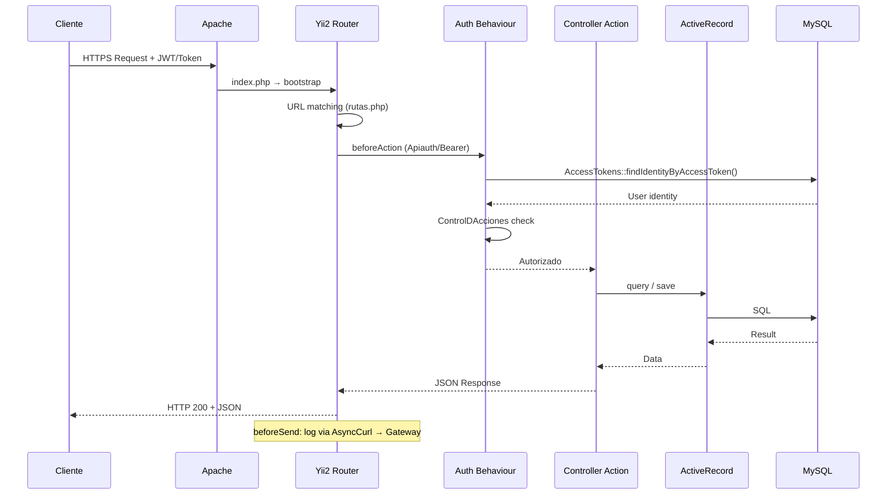

# Arquitectura de Alto Nivel — Muvinapp

> **Última revisión:** 2026-04-21
> **Ver también:** [[stack-tecnologico]], [[cross-module-dependencies]], [[vision-general]]

---

## Diagrama de capas del sistema

```mermaid
graph TD
    subgraph Clientes["Clientes (externos)"]
        FE["🖥️ Frontend Panel\ndev.muvinapp.com/logistica"]
        APP["📱 App Móvil Chofer"]
        BOT["💬 WhatsApp/ChatBot"]
        EXT["🔌 Sistemas externos\n(Stop, MAGYP, MTR, Bus)"]
    end

    subgraph API["API RESTful — backend/ (Apache + PHP 7.4 + Yii2 2.0.48)"]
        AUTH["🔒 Capa de Autenticación\nApiauth / HttpBearerAuth / JWT\nControlDAcciones / RBAC"]
        CORS["CORS Filter\ncors.php"]
        V1["📦 API v1\n~170 controladores\nbackend/controllers/"]
        V2["📦 Módulo v2\nCupos legacy\nbackend/modules/v2/"]
        V3["📦 Módulo v3\nCupos CCPP, Turnos\nbackend/modules/v3/"]
        MAGYP["🔌 Módulo magyp\nCarta de Porte AFIP"]
        MTR["🔌 Módulo mtr\nMATba/Rofex"]
        FERT["📦 Módulo fertilizantes"]
        AGRO["📦 Módulo agroquimicos"]
        ERP["📦 Módulo erp"]
        BOT_MOD["📦 Módulo bot"]
        TURNEADA["📦 Módulo turneada"]
        SERVICE["🔒 Módulo service\nRBAC proxy"]
    end

    subgraph COMMON["Capa común — common/"]
        MODELS["Modelos ActiveRecord\nUser, Cupo, CartaPorte, etc."]
        COMPONENTS["Componentes\nJWT, Socket, Curl, PDF, Excel\nNotificaciones, AFIP"]
        QUEUE["🔄 Queue (DB)\nyii2-queue"]
        JOBS["🔄 Jobs asíncronos"]
    end

    subgraph CONSOLE["Consola — console/"]
        CRON["🔄 Cron Jobs\nAfip, Chofer, Cupo\nDemandas, Destino"]
        MIGRATIONS["623 Migraciones\nMySQL/MariaDB"]
    end

    subgraph DB["Capa de datos"]
        MYSQL["🗄️ MySQL / MariaDB\nBase de datos principal"]
        FCACHE["📁 FileCache\nyii2 cache"]
    end

    subgraph EXTERNAL["Servicios externos"]
        AFIP_EXT["🔌 AFIP / Stop\nCTG, carta de porte"]
        MAGYP_EXT["🔌 MAGYP\nMinisterio Agricultura"]
        MTR_EXT["🔌 MATba/Rofex MTR"]
        RBAC_EXT["🔒 MS RBAC\nRoles y permisos"]
        GATEWAY["📊 Gateway API\nCentralización logs"]
        SOCKET_SRV["⚡ Socket.IO Server\nWebSockets real-time"]
        INFOBIP["📱 Infobip SMS"]
        WHATSAPP["💬 WhatsApp Business"]
        LOGISTICA["🔌 MS Logística"]
        DOCS_MS["📄 MS Documentaciones"]
        BUS["🔌 Bus Integración\nVTerra"]
        DESCARGAS["📥 Descargas API"]
    end

    %% Clientes → API
    FE -->|"HTTPS + JWT Bearer"| CORS
    APP -->|"HTTPS + x-access_token"| CORS
    BOT -->|"HTTPS + ChatBotAuth"| CORS
    EXT -->|"HTTPS"| CORS

    %% Auth flow
    CORS --> AUTH
    AUTH --> V1
    AUTH --> V2
    AUTH --> V3
    AUTH --> MAGYP
    AUTH --> MTR
    AUTH --> FERT
    AUTH --> AGRO
    AUTH --> ERP
    AUTH --> BOT_MOD
    AUTH --> TURNEADA
    AUTH --> SERVICE

    %% API → Common
    V1 --> MODELS
    V1 --> COMPONENTS
    V3 --> MODELS
    MAGYP --> MODELS
    MODELS --> MYSQL

    %% Queue
    COMPONENTS --> QUEUE
    QUEUE --> JOBS
    JOBS --> MYSQL

    %% Console
    CRON --> COMPONENTS
    CRON --> MYSQL
    MIGRATIONS --> MYSQL

    %% Cache
    COMPONENTS --> FCACHE

    %% External
    COMPONENTS -->|"AsyncCurl"| GATEWAY
    COMPONENTS -->|"IntegracionAfip\nStopConnect"| AFIP_EXT
    MAGYP -->|"HTTP REST"| MAGYP_EXT
    MTR -->|"MtrConnect"| MTR_EXT
    SERVICE -->|"MicroServicioRbac"| RBAC_EXT
    COMPONENTS -->|"Socket.php\nElephantIO"| SOCKET_SRV
    COMPONENTS -->|"Infobip API"| INFOBIP
    V1 -->|"WhatsApp API"| WHATSAPP
    COMPONENTS -->|"BaseCurl"| LOGISTICA
    COMPONENTS -->|"BaseCurl"| DOCS_MS
    COMPONENTS -->|"BusIntegracion"| BUS
    COMPONENTS -->|"BaseCurl"| DESCARGAS
```

---

## Descripción de capas

### Capa de clientes
- **Frontend Panel**: SPA o MPA (⚠️ Pendiente de verificar stack frontend) que consume esta API. URLs conocidas: `dev.muvinapp.com/logistica`, `dev.muvinapp.com/lite`, `dev.muvinapp.com/descargas`.
- **App Móvil Chofer**: Aplicación móvil que usa los endpoints del chofer. Autenticación por `x-access_token`.
- **WhatsApp/ChatBot**: El bot utiliza el módulo `bot/` y `ChatBotController` para recibir mensajes y procesar flujos.
- **Sistemas externos**: Stop (AFIP), MAGYP, MTR envían/reciben datos vía HTTP.

### Capa API (backend/)
- Entry point: `backend/web/index.php` (Apache → Yii2)
- Filtros globales: CORS (`cors.php`), autenticación (`Apiauth`, `HttpBearerAuth`), control de acciones (`ControlDAcciones`), sanitización de inputs (`FilterMethods` con `purificar()` + HtmlPurifier)
- **~170 controladores v1** heredan de `ApiRestController` que extiende `yii\rest\ActiveController`
- **10 módulos** especializados con sus propios controladores y modelos

### Capa común (common/)
- Modelos ActiveRecord compartidos entre backend y console
- Componentes reutilizables: JWT, PDF, Excel, Sockets, AFIP, Curl
- Queue Yii2 con driver DB para jobs asíncronos

### Capa de consola (console/)
- Cron jobs programados (AFIP, choferes, cupos, demandas)
- 623 migraciones de base de datos

### Capa de datos
- MySQL/MariaDB (⚠️ versión exacta pendiente de verificar en `main-local.php`)
- FileCache Yii2 para caching

### Servicios externos
Ver [[stack-tecnologico#Integraciones externas (servicios de terceros)]].

---

## Flujo de una request típica

---

## Módulos y sus rutas base

| Módulo | Ruta base | Controladores |
|--------|-----------|---------------|
| V1 (principal) | `/` (sin prefijo) | `backend/controllers/` |
| V2 | `/v2/` | `backend/modules/v2/controllers/` |
| V3 | `/v3/` | `backend/modules/v3/controllers/` |
| MAGYP | `/magyp/` | `backend/modules/magyp/controllers/` |
| MTR | `/mtr/` | `backend/modules/mtr/controllers/` |
| Fertilizantes | `/fertilizantes/` | `backend/modules/fertilizantes/controllers/` |
| Agroquímicos | Sin prefijo propio (via bus) | `backend/modules/agroquimicos/controllers/` |
| ERP | Sin prefijo propio | `backend/modules/erp/controllers/` |
| Bot | Sin prefijo propio | `backend/modules/bot/controllers/` |
| Turneada | `/turneada/` | `backend/modules/turneada/controllers/` |
| Service (RBAC) | `/auth/` | `backend/modules/service/` |
