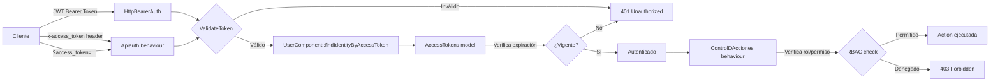

# Stack Tecnológico — Muvinapp API Panel

> **Última revisión:** 2026-04-21
> **Ver también:** [[arquitectura-alto-nivel]], [[core-vs-custom-dependencies]]

---

## Tabla principal de dependencias

| Tecnología | Versión | Propósito | Soporte Vendor | Riesgo |
|-----------|---------|-----------|----------------|--------|
| **PHP** | 7.4+ (req: ≥5.4) | Lenguaje base | ⚠️ EOL desde Nov 2022 | 🔴 Alto — sin parches de seguridad |
| **Yii2 Advanced Template** | 2.0.48 | Framework MVC + REST | 🟡 Mantenimiento mínimo | 🟡 Medio — sin nuevas features |
| **yiisoft/yii2** | 2.0.48 | Core del framework | 🟡 Solo security patches | 🟡 Medio |
| **firebase/php-jwt** | 6.4 | Autenticación JWT | 🟢 Vigente | 🟢 Bajo |
| **light/yii2-swagger** | 3.0.2 | Documentación OpenAPI/Swagger | 🟡 Poco activo | 🟡 Medio |
| **phpoffice/phpspreadsheet** | 1.18.0 | Generación de Excel | 🟢 Vigente (v2.x disponible) | 🟡 Medio — versión desactualizada |
| **kartik-v/yii2-mpdf** | * (cualquier) | Generación de PDFs | 🟡 Activo | 🟡 Medio |
| **spatie/pdf-to-image** | * | Conversión PDF → imagen | 🟢 Vigente | 🟢 Bajo |
| **linslin/yii2-curl** | * | Cliente HTTP para integraciones | 🟡 Poco activo | 🟡 Medio |
| **yiisoft/yii2-queue** | ^2.3.7 | Cola de jobs asíncronos (DB-backed) | 🟡 Mantenimiento | 🟡 Medio |
| **yiisoft/yii2-swiftmailer** | ~2.0 / ~2.1 | Envío de emails | ⚠️ SwiftMailer deprecated → Symfony Mailer | 🔴 Alto — librería discontinuada |
| **yiisoft/yii2-bootstrap** | ~2.0 | Assets Bootstrap (views/PDFs) | 🟡 Solo compat Yii2 | 🟡 Bajo impacto |
| **ElephantIO** (local) | 2.x (estimado) | Cliente WebSocket/Socket.IO PHP | 💀 Vendorizado localmente, sin versión | 🔴 Alto — no gestionado por Composer |
| **MySQL / MariaDB** | ⚠️ Pendiente de verificar | Base de datos relacional | 🟢 Vigente | 🟢 Bajo |
| **Apache + PHP-FPM** | ⚠️ Pendiente de verificar | Servidor web en Docker | 🟢 Vigente | 🟢 Bajo |
| **Docker / Docker Compose** | ⚠️ Pendiente de verificar | Contenedorización y despliegue | 🟢 Vigente | 🟢 Bajo |
| **Codeception** | ⚠️ Pendiente de verificar | Testing (Unit/Functional/API) | 🟢 Vigente | 🟢 Bajo |

---

## Dependencias de desarrollo

| Tecnología | Versión | Propósito |
|-----------|---------|-----------|
| **yiisoft/yii2-debug** | ~2.0.0 | Panel de debug (solo dev) |
| **yiisoft/yii2-gii** | ~2.0.0 | Generador de código (solo dev) |
| **yiisoft/yii2-faker** | ~2.0.0 | Generación de fixtures |
| **bower-asset/jquery** | ~3.6.4 | jQuery para views |
| **bower-asset/inputmask** | ~3.3.11 | Máscaras de input |

---

## Integraciones externas (servicios de terceros)

| Integración | Propósito | Tipo | Estado | Riesgo |
|------------|-----------|------|--------|--------|
| **MAGYP / AFIP** | Emisión carta de porte electrónica (CPe) | HTTP REST | 🟢 Activo | 🔴 Crítico — core del negocio |
| **Stop (AFIP)** | Consulta CTG (tránsito granos) | HTTP REST | 🟢 Activo | 🔴 Crítico — validación de viajes |
| **MTR (MATba/Rofex)** | Gestión de carátulas mercado a término | HTTP REST | 🟡 Simulable | 🟡 Medio |
| **Bus Integración (VTerra)** | Integración externa de operaciones | HTTP REST | 🟡 Simulable | 🟡 Medio |
| **Microservicio RBAC** | Roles y permisos externos | HTTP REST | 🟢 Activo | 🔴 Alto — afecta toda la auth |
| **Gateway API (logging)** | Centralización de logs | HTTP async | 🟢 Activo | 🟡 Medio |
| **Socket.IO server** | Comunicación en tiempo real con choferes | WebSocket | 🟢 Activo | 🟡 Medio |
| **Infobip** | Envío de SMS | HTTP REST | 🟢 Activo | 🟡 Medio |
| **WhatsApp Business** | Mensajería con choferes | HTTP REST | 🟢 Activo | 🟡 Medio |
| **Logística MS** | Microservicio de logística | HTTP REST | 🟢 Activo | 🟡 Medio |
| **Documentaciones MS** | Gestión de documentos | HTTP REST | 🟢 Activo | 🟡 Medio |
| **Descargas API** | Generación de reportes/descargas | HTTP REST | 🟢 Activo | 🟡 Bajo |
| **Rosporcino** | Oferta de mercado porcino | HTTP REST | 🟡 Uso limitado | 🟢 Bajo |

---

## Arquitectura de autenticación

---

## Versiones de PHP — situación de riesgo

> [!danger] Riesgo crítico de plataforma
> PHP 7.4 llegó a End of Life el **28 de noviembre de 2022**. Esto significa que **no recibe parches de seguridad** desde esa fecha. El `composer.json` declara `"php": ">=5.4.0"`, lo cual permite instalar en versiones muy antiguas sin advertencia.
> Ver [[deuda-tecnica]] y [[recomendaciones-modernizacion]].

---

## Estado de la cola de jobs (yii2-queue)

- **Driver:** Base de datos (tabla `{{%queue}}`, mutex MySQL)
- **Canal:** `default`
- **Workers:** ⚠️ Pendiente de verificar — configuración de workers en `daemons-app.json`
- **Jobs conocidos:** ver `common/jobs/`

---

## Configuración de ambientes

| Ambiente | Config | URL base |
|---------|--------|----------|
| Dev | `main-local.php` (montado vía Docker volume) | `dev.muvinapp.com` |
| QA | idem | ⚠️ Pendiente de verificar |
| Prod | idem | `panel.muvinapp.com` (comentado en params.php) |

> ⚠️ Las URLs de producción están **comentadas** en `params.php`. Esto sugiere que se inyectan vía `main-local.php` en el servidor. Confirmar.
