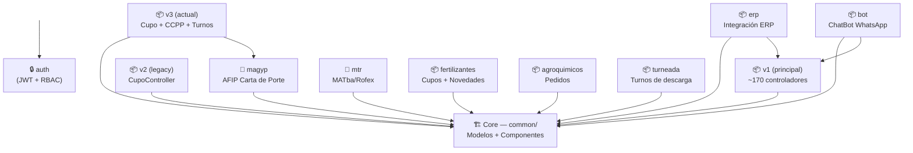

# Índice de Módulos — Muvinapp

> **Última revisión:** 2026-04-21
> **Ver también:** [[arquitectura-alto-nivel]], [[functional-classification]]

---

## Módulos versionados

| Módulo | Estado | Doc |
|--------|--------|-----|
| [[modulo-v2\|V2 (Legacy)]] | 🟡 Legacy — mantener sin evolucionar | [[modulo-v2]] |
| [[modulo-v3\|V3 (Actual)]] | 🟢 Principal — en uso activo | [[modulo-v3]] |

## Módulos de integración externa

| Módulo | Integra con | Doc |
|--------|-------------|-----|
| [[modulo-magyp\|MAGYP]] | AFIP / Ministerio Agricultura | [[modulo-magyp]] |
| [[modulo-mtr\|MTR]] | MATba / Rofex | [[modulo-mtr]] |

## Módulos de negocio principal

| Módulo | Propósito | Doc |
|--------|-----------|-----|
| [[modulo-cupos\|Cupos]] | Ciclo de vida de cupos de descarga | [[modulo-cupos]] |
| [[modulo-choferes\|Choferes]] | Gestión de conductores | [[modulo-choferes]] |
| [[modulo-centros\|Centros]] | Terminales y plantas de descarga | [[modulo-centros]] |
| [[modulo-viajes\|Viajes]] | Solicitudes y seguimiento de viajes | [[modulo-viajes]] |
| [[modulo-turneada\|Turneada]] | Sistema de turnos de descarga | [[modulo-turneada]] |
| [[modulo-auth\|Auth/RBAC]] | Autenticación y permisos | [[modulo-auth]] |

## Módulos especializados

| Módulo | Propósito | Doc |
|--------|-----------|-----|
| [[modulo-fertilizantes\|Fertilizantes]] | Cupos de fertilizantes | [[modulo-fertilizantes]] |
| [[modulo-agroquimicos\|Agroquímicos]] | Pedidos de agroquímicos | [[modulo-agroquimicos]] |
| [[modulo-erp\|ERP]] | Integración con ERP externo | [[modulo-erp]] |
| [[modulo-bot\|Bot]] | ChatBot WhatsApp para choferes | [[modulo-bot]] |

---

## Diagrama de módulos

