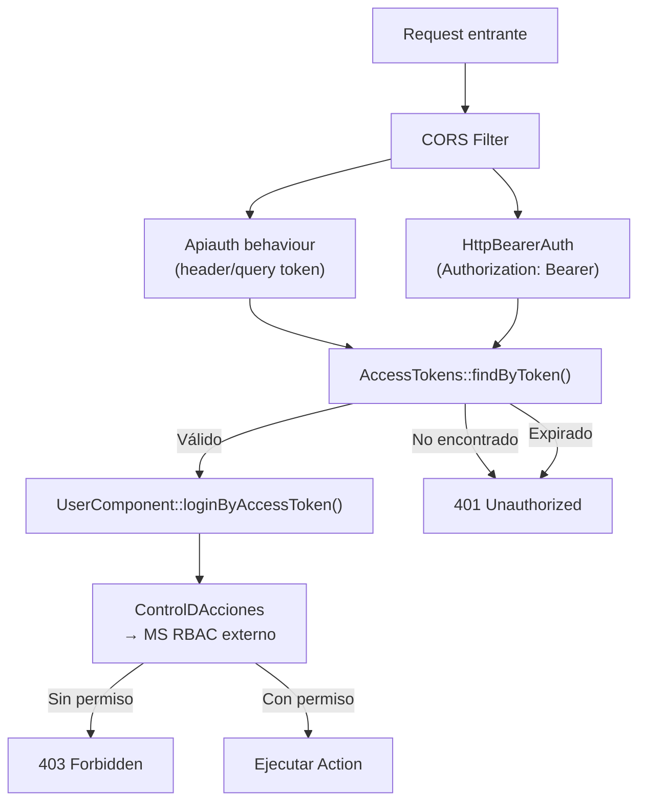

# Módulo Auth — Autenticación y Permisos

> **Última revisión:** 2026-04-21
> **Ruta:** `backend/behaviours/`, `backend/modules/service/`, `common/components/`
> **Ver también:** [[stack-tecnologico]], [[security-inventory]], [[arquitectura-alto-nivel]]

---

## Propósito

El sistema de autenticación de Muvinapp combina **JWT** con un **microservicio RBAC externo** para autenticación y autorización. Implementa múltiples capas de control de acceso.

---

## Componentes de autenticación

### 1. Apiauth (behaviour)
`backend/behaviours/Apiauth.php`
- Intercepta todas las requests (excepto login y options)
- Lee token desde: `x-access_token` header, `x-access-token` header, `?access_token=` GET param, `?access-token=` GET param
- Llama a `loginByAccessToken()` del `UserComponent`
- Rechaza con `sendFailedResponse()` si el token es inválido o está ausente

### 2. HttpBearerAuth
`yii\filters\auth\HttpBearerAuth`
- Lee el token del header `Authorization: Bearer <token>`
- Se añade como behaviour en `ApiRestController`
- Complementa al `Apiauth` behaviour

### 3. CompositeAuth
En `ApiRestController::behaviors()`:
- Combina `HttpBearerAuth` y `QueryParamAuth`
- Permite autenticación tanto por header como por query param

### 4. ControlDAcciones (behaviour)
`backend/behaviours/ControlDAcciones.php`
- Verifica que el usuario autenticado tenga permiso para la acción específica
- Consulta el microservicio RBAC externo
- Lanza `ForbiddenHttpException` si no tiene permiso

### 5. Verbcheck (behaviour)
`backend/behaviours/Verbcheck.php`
- Valida que el método HTTP (GET/POST/PUT/DELETE) sea el correcto para la acción
- Centraliza la validación de verbos HTTP

---

## Flujo de autenticación

---

## Endpoints de login

| Ruta | Método | Propósito |
|------|--------|-----------|
| `POST v1/login` | POST | Login principal — retorna JWT |
| `POST v1/login-panel` | POST | Login para el panel de gestión |
| `POST v1/login-role` | POST | Login con selección de rol |

---

## Microservicio RBAC externo

| Parámetro | Valor |
|-----------|-------|
| URL | `https://dev.muvinapp.com/rbac/` (dev) |
| Token | ⚠️ `params.php: 's-roles-permisos.token': '123456'` — **RIESGO CRÍTICO** |
| Componente | `common/components/MicroServicioRbac.php` |
| UserComponent | `backend/components/UserComponent.php` → `CheckAccess` |

---

## Módulo Service (proxy RBAC)

`backend/modules/service/` — Actúa como proxy entre la API y el microservicio RBAC. Permite que el frontend consulte roles y permisos a través de esta API en lugar de llamar directamente al microservicio.

---

## Gestión de usuarios

| Controlador | Propósito |
|-------------|-----------|
| `ApiUsuarioController.php` | CRUD de usuarios de la API |
| `UsuarioController.php` | CRUD completo de usuarios |
| `RolControlesController.php` | Asignación de roles a controles de interfaz |
| `PermisosPorUsuarioController.php` | Permisos específicos por usuario |
| `ModulosUsuarioController.php` | Módulos habilitados por usuario |
| `PersonaUsuarioController.php` | Vinculación persona↔usuario |
| `MenuDinamicoController.php` | Menú dinámico según permisos |

---

## Hallazgos de seguridad

> [!danger] Token RBAC hardcodeado
> El token `s-roles-permisos.token` tiene el valor `'123456'` en `params.php`. Si este valor se usa en producción, cualquier atacante puede impersonar al sistema frente al microservicio RBAC. Ver [[security-inventory]].

> [!warning] CORS wildcard
> La configuración CORS en `cors.php` incluye `'origins' => ['*']`. Verificar si se restringe en producción mediante `main-local.php`.

> [!info] TestJwtFirebase
> Existe `TestJwtFirebaseController.php` en `backend/controllers/`. Verificar que no esté accesible en producción.
