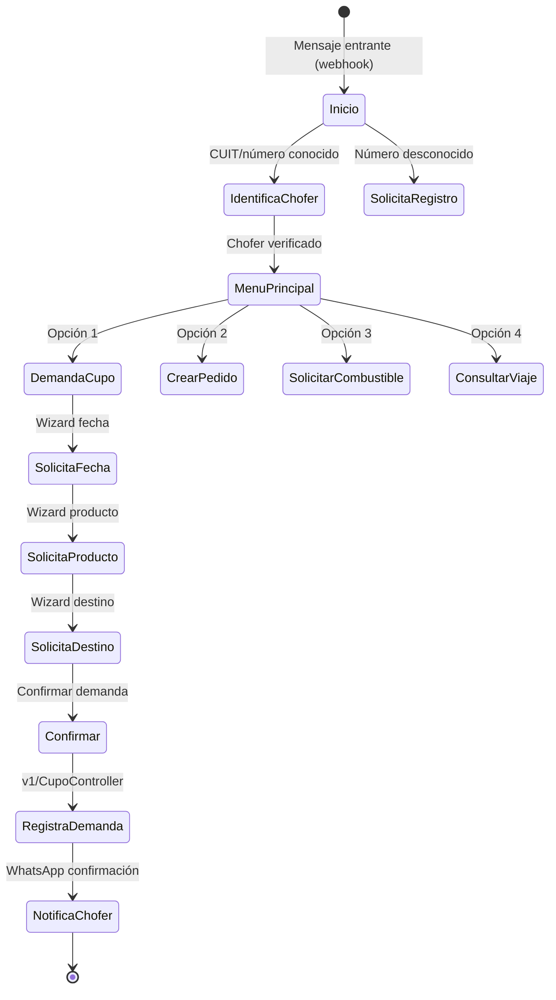

# Módulo Bot — ChatBot WhatsApp

> **Última revisión:** 2026-04-21
> **Namespace:** `bot\`
> **Ruta:** `backend/modules/bot/`
> **Ver también:** [[_indice-modulos]], [[flujo-bot-chofer]]

---

## Propósito

El módulo **bot** implementa el **chatbot de WhatsApp para choferes**. Permite que los choferes interactúen con el sistema a través de conversaciones de WhatsApp para realizar operaciones como demandar cupos, crear pedidos, solicitar combustible y consultar estado de viajes.

---

## Controladores

| Controlador | Propósito |
|-------------|-----------|
| `DefaultController` | Controlador único del bot — recibe webhooks de WhatsApp y procesa estados de conversación |

---

## Flujo conversacional

---

## Integraciones

| Integración | Propósito |
|------------|-----------|
| **WhatsApp Business API** | Canal de entrada/salida de mensajes |
| **Infobip** | Envío de SMS alternativos |
| **v1 controllers** | Crear pedidos, demandar cupos, consultar datos |
| **common/models** | Acceso a datos de choferes, cupos, destinos |

---

## Componente ChatBotController (backend/controllers)

Además del módulo `bot/`, existe `backend/controllers/ChatBotController.php` que gestiona:
- `ParametrosChat` — configuración del bot
- `OperadoresChat` — operadores que intervienen en conversaciones

---

## Notas

> [!info] Arquitectura de conversación
> El estado de la conversación del chofer probablemente se guarda en base de datos (tabla a confirmar). Cada mensaje entrante del webhook de WhatsApp dispara una request al bot controller.

> [!warning] Sin autenticación estándar
> Los webhooks de WhatsApp no usan el sistema JWT estándar de la API. Verificar qué mecanismo de validación usa el webhook (HMAC signature, secret token, etc.).
