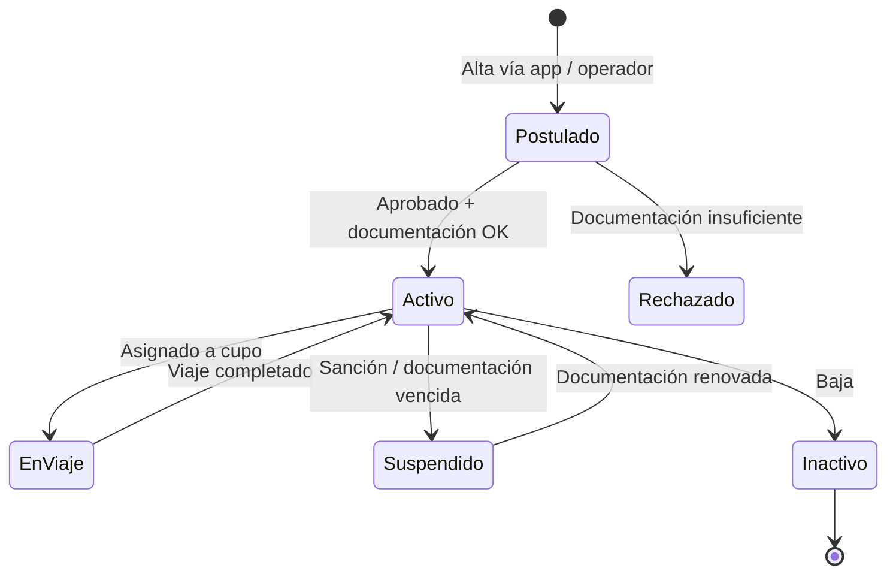

# Módulo Choferes

> **Última revisión:** 2026-04-21
> **Ruta:** `backend/controllers/Chofer*.php`, `DocumentacionChoferController.php`, etc.
> **Ver también:** [[modulo-cupos]], [[modulo-bot]], [[flujo-alta-cupo]]

---

## Propósito

El dominio **Choferes** gestiona el ciclo de vida completo de los conductores de camiones: alta, documentación, habilitación, seguimiento y métricas.

---

## Controladores

| Controlador | Propósito |
|-------------|-----------|
| `ChoferController.php` | CRUD principal del chofer |
| `ChoferAppController.php` | Vista/acciones para el chofer desde la app móvil |
| `ChoferEquipoController.php` | Equipos asignados al chofer (camión + acoplado) |
| `ChoferPostuladoController.php` | Choferes postulados (pendientes de aprobación) |
| `DocumentacionChoferController.php` | Documentos del chofer (licencias, seguros, etc.) |
| `BusquedaChoferController.php` | Búsqueda de choferes por CUIT/nombre/estado |
| `BusquedaChoferHuerfanoController.php` | Choferes sin transportista asociado |
| `HistoricoChoferLibreController.php` | Historial de períodos libres |
| `HistoricoPremioSancionController.php` | Historial de premios y sanciones |
| `EstadoChoferController.php` | Estados del chofer en tiempo real |
| `ListaChoferesCentroController.php` | Choferes por centro/terminal |

---

## Ciclo de vida del chofer

---

## Documentación del chofer

Tipos de documentos tracked:
- Licencia de conducir (categorías)
- Seguro del vehículo
- VTV / inspección técnica
- Libreta sanitaria
- Certificado de aptitud médica

> ⚠️ El vencimiento de documentos puede activar bloqueos automáticos (verificar si hay job/cron que los procesa).

---

## Integración con App Móvil

El endpoint `ChoferAppController` sirve los datos que consume la aplicación móvil del chofer. Incluye:
- Estado actual del chofer
- Cupos disponibles para demandar
- Historial de viajes
- Notificaciones

---

## Lista negra

Los choferes pueden ser incluidos en la lista negra mediante `ListaNegraController`. Un chofer en lista negra no puede ser asignado a cupos.

---

## Búsqueda y lookup

- `BusquedaChoferController` — búsqueda full-text por CUIT, nombre, transportista
- `BusquedaChoferHuerfanoController` — choferes sin transportista asignado (gestión especial)
