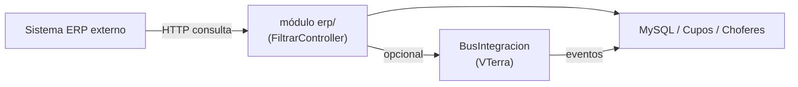

# Módulo ERP — Integración ERP Externo

> **Última revisión:** 2026-04-21
> **Namespace:** `erp\`
> **Ruta:** `backend/modules/erp/`
> **Ver también:** [[modulo-fertilizantes]], [[_indice-modulos]]

---

## Propósito

El módulo **erp** provee la interfaz de integración con el **sistema ERP externo**. Permite filtrar y exponer datos del sistema hacia procesos de integración empresarial.

---

## Controladores

| Controlador | Propósito |
|-------------|-----------|
| `DefaultController.php` | Punto de entrada del módulo ERP |
| `FiltrarController.php` | Filtrado y exportación de datos hacia ERP |

---

## Funcionalidad conocida

- `FiltrarController` permite filtrar datos de cupos, choferes y transportistas para consumo por parte de sistemas ERP externos
- La integración probablemente es unidireccional (ERP consulta esta API) o bidireccional a través del **Bus de Integración** (VTerra)

---

## Relación con Bus de Integración

---

## Notas

> [!note] Documentación pendiente
> El módulo ERP es uno de los menos documentados en el código. Se requiere investigación adicional de `DefaultController.php` y `FiltrarController.php` para documentar endpoints y datos expuestos.

> [!warning] Datos sensibles
> Cualquier endpoint que filtre datos de cupos/clientes/transportistas hacia un sistema externo debe tener autenticación robusta. Verificar que `ControlDAcciones` está activo.
