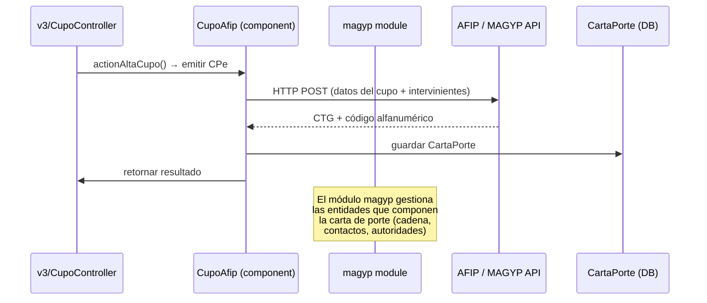

# Módulo MAGYP — Carta de Porte AFIP

> **Última revisión:** 2026-04-21
> **Namespace:** `magyp\`
> **Ruta:** `backend/modules/magyp/`
> **Ver también:** [[modulo-v3]], [[flujo-carta-porte]], [[stack-tecnologico]]

---

## Propósito

El módulo **magyp** es la interfaz hacia el **Ministerio de Agricultura, Ganadería y Pesca (MAGYP)** del gobierno argentino. Gestiona la emisión, validación y seguimiento de la **Carta de Porte Electrónica (CPe)**, que es el documento obligatorio para el transporte de granos en Argentina.

> Este módulo es **crítico para el negocio** — sin la carta de porte no puede realizarse el transporte legal de granos.

---

## Controladores

| Controlador | Propósito |
|-------------|-----------|
| `CadenaController` | Gestión de cadena de intervinientes de la carta de porte |
| `ContactoController` | Contactos habilitados ante MAGYP |
| `AutoridadSaludController` | Autoridades sanitarias (organismos de control) |
| `ReporteController` | Reportes de seguimiento de cartas de porte |
| `TestController` | Endpoints de prueba (⚠️ Verificar si está expuesto en producción) |
| `DefaultController` | Stub de módulo |

---

## Endpoints conocidos (por rutas)

Las rutas del módulo MAGYP están definidas en `backend/config/rutas.php` bajo el prefijo `magyp/`:

| Ruta | Controlador/Acción | Propósito |
|------|-------------------|-----------|
| `GET magyp/cadena/index` | CadenaController → actionIndex | Listar cadenas |
| `GET magyp/cadena/view/{id}` | CadenaController → actionView | Ver cadena |
| `POST magyp/cadena/create` | CadenaController → actionCreate | Crear cadena |
| `PUT magyp/cadena/update/{id}` | CadenaController → actionUpdate | Actualizar cadena |
| `DELETE magyp/cadena/delete/{id}` | CadenaController → actionDelete | Eliminar cadena |
| `GET magyp/contacto/*` | ContactoController → CRUD | Gestión de contactos MAGYP |
| `GET magyp/autoridad-salud/*` | AutoridadSaludController → CRUD | Autoridades sanitarias |
| `GET magyp/reporte/seguimiento` | ReporteController → actionSeguimiento | Reporte de seguimiento |
| `GET magyp/test/*` | TestController → varios | ⚠️ Solo para tests |

---

## Relación con AFIP / MAGYP (servicios externos)

---

## Entidades gestionadas por MAGYP

| Entidad | Descripción |
|---------|-------------|
| **Cadena** | La cadena de intervinientes: productor, intermediario, corredor, transportista, destinatario |
| **Contacto** | Personas físicas/jurídicas habilitadas por MAGYP para operar |
| **AutoridadSalud** | Organismos oficiales de control sanitario (SENASA, etc.) |
| **CartaPorte** | Documento de transporte (tabla `carta_porte` en DB) |

---

## Notas importantes

> [!danger] TestController en producción
> El archivo `TestController.php` en módulo magyp debe ser auditado para verificar que no está expuesto en producción sin autenticación. Ver [[security-inventory]].

> [!info] Dependencia con Stop/CTG
> La carta de porte genera un CTG (Código de Tránsito de Granos) validado por STOP/AFIP. El flag `simulacionStop: true` en `params.php` simula esta validación en ambiente de desarrollo.

> [!warning] Datos de campos
> Los campos de la cadena de intervinientes deben coincidir exactamente con los enumerados por AFIP/MAGYP. Cambios en el registro pueden causar rechazos de la CPe.
