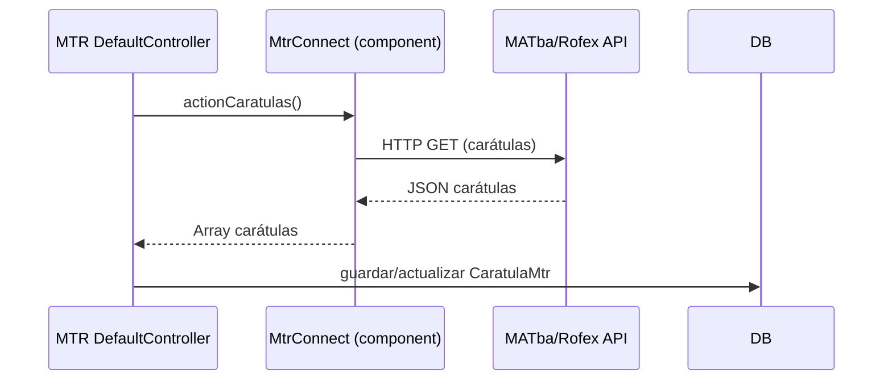

# Módulo MTR — Mercado a Término (MATba/Rofex)

> **Última revisión:** 2026-04-21
> **Namespace:** `mtr\`
> **Ruta:** `backend/modules/mtr/`
> **Ver también:** [[modulo-v3]], [[stack-tecnologico]]

---

## Propósito

El módulo **mtr** integra la plataforma con **MATba-Rofex (Mercado a Término de Rosario)**, permitiendo gestionar las **carátulas de mercado a término**. Las carátulas son documentos que vinculan contratos de compraventa de granos con el transporte físico.

---

## Controladores

| Controlador | Propósito |
|-------------|-----------|
| `DefaultController` | Controlador principal (único) — gestiona carátulas, usuarios, filtros |

---

## Endpoints

| Acción | Método | Propósito |
|--------|--------|-----------|
| `actionIndex` | GET | Listado principal de carátulas |
| `actionRegistrarUsuario` | POST | Registrar usuario en MTR |
| `actionCaratulas` | GET | Obtener carátulas del mercado a término |
| `actionCaratulasReporte` | GET | Reporte de carátulas (exportable) |
| `actionFiltro` | GET | Filtrar carátulas por criterios |
| `actionRefrescar` | POST | Refrescar estado de carátulas desde MTR |
| `actionOptions` | OPTIONS | CORS preflight |

---

## Conexión a MTR (MtrConnect)

---

## Configuración

| Parámetro | Dónde | Descripción |
|-----------|-------|-------------|
| `mtrConnect.url` | `common/config/main.php` | URL base del servicio MTR |
| `mtrConnect.token` | ⚠️ Pendiente de verificar | Token de autenticación MTR |

---

## Notas

> [!info] Simulación disponible
> Al igual que AFIP/Stop, las carátulas MTR pueden simularse sin conexión real. Verificar flag en `params.php`.

> [!note] Módulo simple
> MTR tiene un único controlador y funcionalidad acotada. Es uno de los módulos con menor acoplamiento del sistema.
