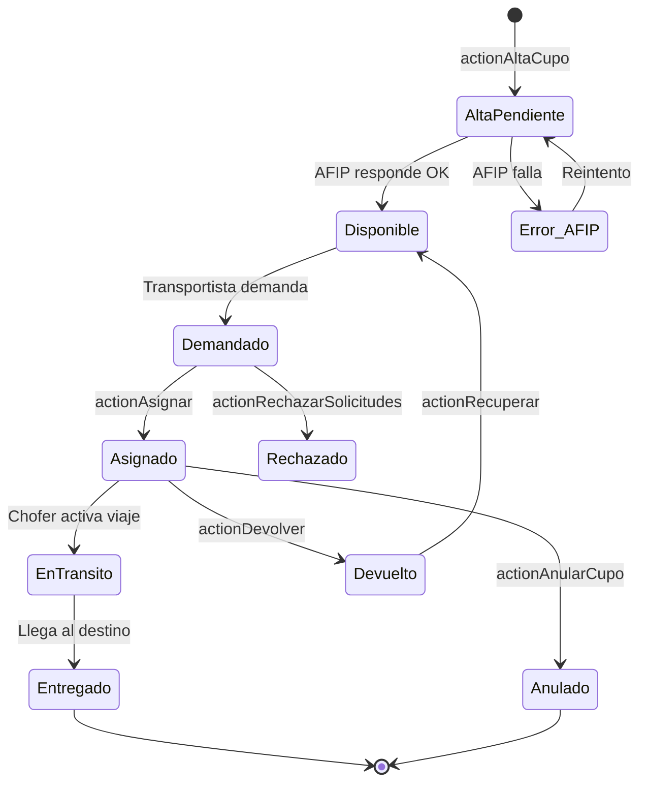
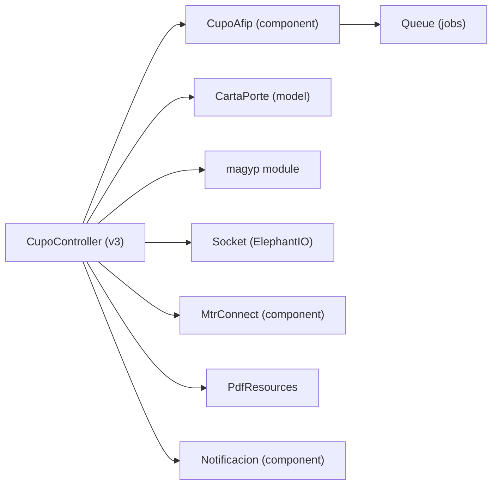

# Módulo V3 — Cupos CCPP y Gestión Core

> **Última revisión:** 2026-04-21
> **Namespace:** `v3\`
> **Ruta:** `backend/modules/v3/`
> **Ver también:** [[modulo-magyp]], [[flujo-alta-cupo]], [[modulo-v2]]

---

## Propósito

El módulo **v3** es la versión actual de la API de cupos. Gestiona el ciclo de vida completo de los cupos de transporte de granos, integrando la emisión de la **Carta de Porte Electrónica (CPe)** vía AFIP/MAGYP. Reemplaza el módulo legacy v2 para la mayoría de los casos de uso.

---

## Controladores

| Controlador | Modelo base | Propósito principal |
|-------------|-------------|---------------------|
| `CupoController` | `v3\models\Cupo` | Ciclo de vida completo del cupo — el más grande del sistema (5754+ líneas) |
| `CabeceraController` | Cabecera | Gestión de cabeceras de cupo (header fijo del cupo) |
| `CentroInternoController` | CentroInterno | Consulta centros/terminales internos |
| `AuditoriaController` | Auditoria | Auditoría de cambios en cupos |
| `DemandaTipoOperacionController` | DemandaTipoOperacion | Tipos de operación para demandas |
| `DemandaTipoProduccionController` | DemandaTipoProduccion | Tipos de producción para demandas |
| `TurnosController` | Turnos | Gestión de turnos de descarga |
| `ZonaCentroController` | ZonaCentro | Zonas geográficas vinculadas a centros |
| `CupoContratoController` | CupoContrato | Cupos asociados a contratos |
| `DefaultController` | — | Stub por defecto del módulo |

---

## Endpoints de CupoController (acciones principales)

| Acción | Método | Ruta típica | Propósito |
|--------|--------|-------------|-----------|
| `actionIndex` | GET | `GET v3/cupos` | Listado paginado de cupos |
| `actionAltaCupo` | POST | `POST v3/cupos/alta-cupo` | Crear nuevo cupo (con CCPP/AFIP) |
| `actionAltaCupoUa` | POST | `POST v3/cupos/alta-cupo-ua` | Alta cupo para Unidad de Almacenaje |
| `actionCcppProblema` | — | — | Gestión cupos con problemas CCPP |
| `actionListado` | GET | `GET v3/cupos/listado/{fecha}` | Listado de cupos por fecha |
| `actionDestinados` | GET | `GET v3/cupos/destinados/{fecha}` | Cupos destinados a centros |
| `actionDisponibles` | GET | `GET v3/cupos/disponibles` | Cupos disponibles para asignar |
| `actionDemandados` | GET | `GET v3/cupos/demandados` | Cupos en estado demandado |
| `actionDestinatarios` | GET | — | Lista de destinatarios de cupos |
| `actionSeguimiento` | GET | — | Seguimiento estado cupos |
| `actionSeguimientoCupos` | GET | — | Seguimiento por zona y fecha |
| `actionListadoAsignacion` | GET | — | Cupos en proceso de asignación |
| `actionAllMap` | GET | — | Datos para mapa general de cupos |
| `actionAdicionar` | POST | — | Adicionar cupo a existente |
| `actionAdicionar2` | POST | — | Adicionar v2 (segunda variante) |
| `actionAdicionarInyeccion` | POST | — | Adicionar por inyección de datos |
| `actionAplicarCabecera` | POST | — | Aplicar cabecera a cupo |
| `actionAsignar` | POST | — | Asignar cupo a chofer/viaje |
| `actionAsignar2` | POST | — | Asignar variante 2 |
| `actionAsignarCuposUa` | POST | — | Asignación para Unidades de Almacenaje |
| `actionListadoRecuperar` | GET | — | Cupos para recuperar |
| `actionRecuperar` | POST | — | Recuperar cupo anulado/devuelto |
| `actionDevolver` | POST | — | Devolver cupo asignado |
| `actionDevolverSinCaratula` | POST | — | Devolver sin carátula MTR |
| `actionCargaSolicitud` | POST | — | Cargar solicitud de transporte |
| `actionCargaSolicitudDistribuida` | POST | — | Solicitud distribuida multi-centro |
| `actionCargaSolicitudPropia` | POST | — | Solicitud propia del transportista |
| `actionRechazarSolicitudes` | POST | — | Rechazar solicitudes pendientes |
| `actionGestionCupos` | GET | — | Vista de gestión de cupos por zona |
| `actionSolicitudMicroServicio` | POST | — | Enviar solicitud a microservicio |
| `actionAnularCupo` | POST | — | Anular cupo activo |
| `actionObtenerCupoPdf` | GET | — | Generar PDF del cupo (carta de porte) |
| `actionValidarCaratula` | GET | — | Validar carátula MTR vs. cupo |
| `actionGetCupoEntregador` | GET | — | Obtener cupo por entregador |
| `actionGetCupoByAlfanumerico` | GET | — | Buscar cupo por código alfanumérico |
| `actionUpdateCupoAfip` | POST | — | Actualizar estado AFIP del cupo |
| `actionNotificarCuposTxt` | POST | — | Notificar cupos por texto |
| `actionValidarCtgRepetido` | GET | — | Verificar CTG duplicado |
| `actionGetCupoDescargas` | GET | — | Obtener datos para descarga |

---

## Ciclo de vida de un cupo (estados)

---

## Dependencias internas

---

## Notas y advertencias

> [!warning] Controlador muy grande
> `CupoController.php` tiene más de **5700 líneas**. Es el archivo más extenso del sistema y viola el principio de responsabilidad única. Refactorizar es alta prioridad en [[deuda-tecnica]].

> [!info] Integración CCPP
> La carta de porte electrónica (CPe) se emite en `actionAltaCupo` llamando a `CupoAfip` que hace la integración con AFIP/MAGYP. El resultado se almacena en la tabla `carta_porte`.

> [!note] Flags de simulación
> Los parámetros `simulacionStop` y `simulacionBusIntegracion` en `params.php` permiten operar en modo simulado sin llamar a los servicios externos reales. En producción deben estar en `false`.
