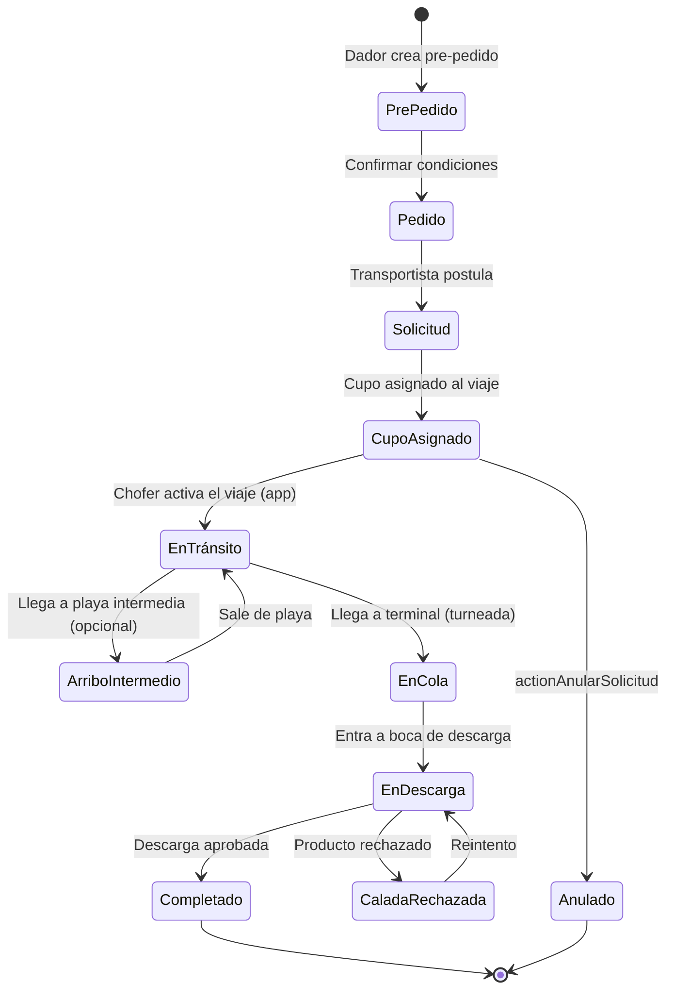

# Módulo Viajes y Solicitudes

> **Última revisión:** 2026-04-21
> **Ruta:** `backend/controllers/Viaje*.php`, `Solicitud*.php`, `PrePedidoController.php`, etc.
> **Ver también:** [[modulo-cupos]], [[modulo-choferes]], [[flujo-alta-cupo]]

---

## Propósito

El dominio **Viajes y Solicitudes** cubre el proceso operativo de transporte: desde la solicitud inicial hasta la entrega en destino. Es el flujo central del negocio.

---

## Controladores

| Controlador | Propósito |
|-------------|-----------|
| `ViajeController.php` | CRUD y gestión del viaje |
| `ViajeEstadoController.php` | Estados y transiciones del viaje |
| `SolicitudController.php` | Solicitudes de transporte |
| `AnularSolicitudController.php` | Anulación de solicitudes |
| `PrePedidoController.php` | Pre-pedidos (paso previo al pedido formal) |
| `PedidoController.php` | Pedidos de transporte |
| `PedidoCondicionesController.php` | Condiciones comerciales del pedido |
| `PedidoTipoAcopladoController.php` | Tipo de acoplado requerido por pedido |
| `PedidoZonaIdealController.php` | Zona ideal de origen para el pedido |
| `SeguimientoController.php` | Seguimiento en tiempo real del viaje |
| `DesvioController.php` | Registro de desvíos del viaje |
| `ArribosIntermediosController.php` | Arribes en puntos intermedios |
| `CaladaRechazadaController.php` | Caladas rechazadas en destino |
| `PosicionSolicitudController.php` | Posición en cola de la solicitud |

---

## Ciclo de vida de un viaje

---

## Seguimiento en tiempo real

El `SeguimientoController` provee datos para el mapa de seguimiento:
- Posición GPS del camión (enviada desde app móvil)
- Estado actual del viaje
- Desvíos registrados

Los datos de posición se procesan vía **Socket.IO** para actualizaciones en tiempo real en el panel.

---

## Desvíos

Cuando un camión se desvía de la ruta autorizada, el sistema registra el desvío con:
- Motivo (`DesvioMotivoController`)
- Posición GPS
- Timestamp
- Operador que registra

---

## Métricas de arribes

`ArribosIntermediosController` registra el paso por puntos intermedios (básculas, playones), generando el reporte de arribes (`PdfArribosController`).

---

## Caladas rechazadas

Si la descarga es rechazada por el terminal (calidad del producto, documentación), se registra en `CaladaRechazada` con el motivo (`MotivoCaladaRechazadaController`).
