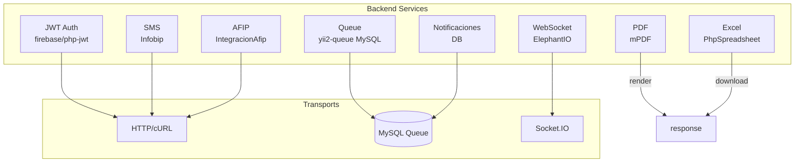

# Índice de Servicios Backend

> **Última revisión:** 2026-04-21
> **Ver también:** [[_indice-modulos]], [[arquitectura-alto-nivel]]

---

## Servicios documentados

| Servicio | Archivo | Estado |
|---------|---------|--------|
| Autenticación JWT | [[servicio-jwt]] | ✅ |
| Cola de trabajos async | [[servicio-queue]] | ✅ |
| Notificaciones (SMS, WA, push) | [[servicio-notificaciones]] | ✅ |
| Generación PDF y Excel | [[servicio-pdf-excel]] | ✅ |
| Integración AFIP | [[servicio-integracion-afip]] | ✅ |
| WebSocket / Socket.IO | [[servicio-socket]] | ✅ |

---

## Mapa de componentes

