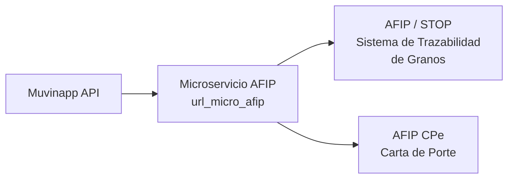
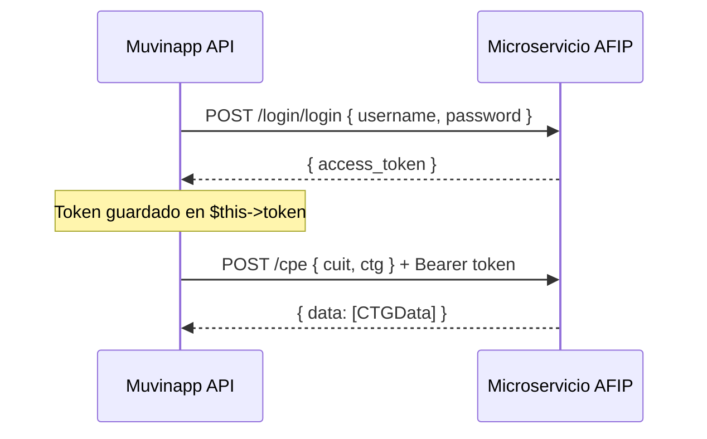

# Servicio de Integración AFIP

> **Última revisión:** 2026-04-21
> **Ver también:** [[modulo-magyp]], [[modulo-v3]], [[flujo-alta-cupo]], [[flujo-carta-porte]]

---

## Descripción

La integración con **AFIP** (Administración Federal de Ingresos Públicos) es la más crítica del sistema. Permite:

1. **Consultar CTG** (Código de Trazabilidad de Granos)
2. **Emitir Carta de Porte Electrónica (CPe)**
3. **Consultar localidades habilitadas**
4. **Gestionar el ciclo de vida AFIP del cupo**

---

## Arquitectura de integración

El sistema **NO conecta directamente con AFIP**. Utiliza un **microservicio intermediario** (`url_micro_afip`) que expone una API REST propia y se comunica con los servicios de AFIP/STOP.



---

## Componente principal — `IntegracionAfip`

**Archivo:** `common/components/IntegracionAfip.php`

Implementa el patrón **Singleton** por sesión de request:

```php
IntegracionAfip::getInstance($user, $pass, $url);
```

### Métodos públicos

| Método | Endpoint interno | Propósito |
|--------|-----------------|-----------|
| `consultarCtg(string $ctg, string $cuit)` | `POST /cpe` | Consulta estado de CTG en AFIP |
| `consultarLocalidades()` | `POST /localidades` | Lista localidades habilitadas para tránsito |

### Flujo de autenticación interna



### Configuración en `params.php`

```php
'user_micro_afip' => '<usuario-ms-afip>',
'pass_micro_afip' => '<password-ms-afip>',
'url_micro_afip'  => '<https://ms-afip.muvinapp.com/>',
```

---

## Variante — `IntegracionAfipMonsanto`

**Archivo:** `common/components/IntegracionAfipMonsanto.php`

Variante del cliente para integración específica con Bayer/Monsanto:

```php
public function consultarCtg(string $ctg) {
    return $this->ejecutor('GET', 'afip/cpe/truck/' . $ctg, [], $this->token)['mensaje'];
}
```

---

## Componente `BuscarCaratulas`

**Archivo:** `common/components/BuscarCaratulas.php`

Busca carátulas de cupos por CTG:

```php
$cupo = Cupo::find()->where(['ctg' => $cartaPorte['nroCartaDePorte']])->one();
```

---

## Componente `NotificarCp`

**Archivo:** `common/components/NotificarCp.php`

Notifica eventos de Carta de Porte a los actores:

- Une `cupo` con `carta_porte` por `ctg = numero_ctg`
- Envía notificación SMS/WhatsApp con el CTG al chofer

---

## Cron AFIP

El archivo `console/log.cronAfip.txt` (**⚠️ committeado al repo**) registra la ejecución de un cron que sincroniza estados con AFIP.

> [!danger] Seguridad
> Los logs de cron pueden contener CUITs, CTGs e información sensible. Este archivo NO debe estar en el repositorio. Ver [[security-inventory]].

---

## Entidades relacionadas con AFIP en el modelo `Cupo`

| Campo | Descripción |
|-------|-------------|
| `ctg` | Código CTG de AFIP |
| `cartaPorte` | Número de carta de porte |
| `cuitChoferAfip` | CUIT del chofer validado AFIP |
| `cuitTransportistaAfip` | CUIT transportista |
| `cuitDestinatarioAfip` | CUIT destinatario |
| `cuitDestinoAfip` | CUIT destino |
| `cuitOrigenAfip` | CUIT origen |
| `cuitCorredorCAfip` | CUIT corredor comprador |
| `cuitCorredorVAfip` | CUIT corredor vendedor |
| `cuitMercadoATerminoAfip` | CUIT mercado a término |
| `cuitIntermediarioFleteAfip` | CUIT intermediario flete |
| `cuitRemComercialAfip` | CUIT remitente comercial |
| `fechaCTG_Desde` | Fecha de inicio del CTG |
