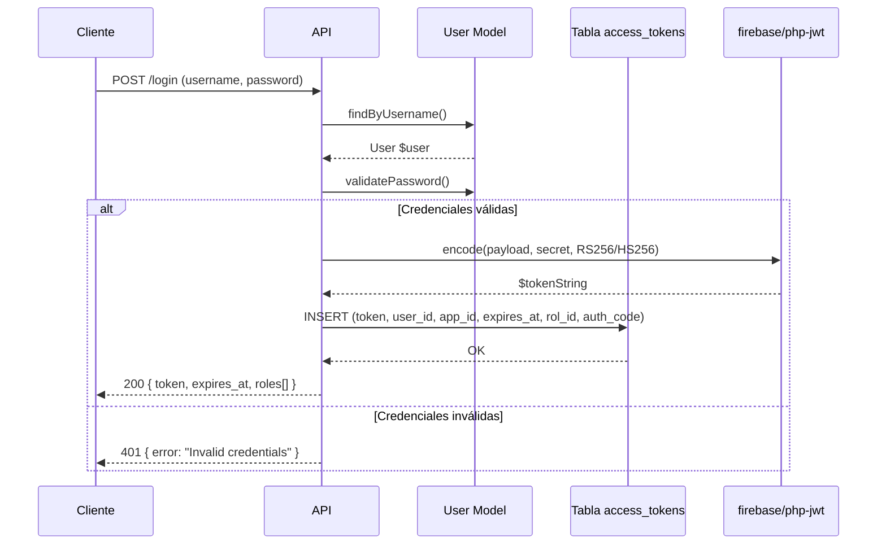
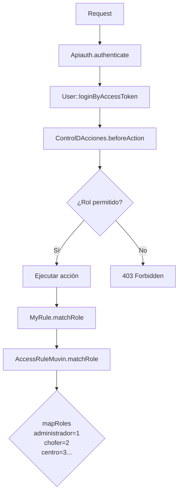

# Servicio JWT — Autenticación por Token

> **Última revisión:** 2026-04-21
> **Ver también:** [[modulo-auth]], [[flujo-autenticacion]], [[security-inventory]]

---

## Descripción

El sistema utiliza **JSON Web Tokens (JWT)** para autenticar todas las peticiones a la API. La librería base es `firebase/php-jwt ^6.4`.

---

## Flujo de autenticación



---

## Componentes involucrados

| Componente | Rol |
|-----------|-----|
| `backend/behaviours/Apiauth.php` | Extrae el token del request (header `x-access-token` o query param `access_token`) |
| `firebase/php-jwt 6.4` | Encode/decode del JWT |
| `common/models/User.php` | Implementa `IdentityInterface`, incluye `loginByAccessToken()` |
| `common/models/AccessTokens.php` | Tabla de tokens activos con expiración |
| `common/components/TokenHelper.php` | Helpers para generación/verificación de tokens |

---

## Estructura del token

```json
{
  "header": {
    "alg": "HS256",
    "typ": "JWT"
  },
  "payload": {
    "sub": "<user_id>",
    "iat": 1710000000,
    "exp": 1710086400,
    "app_id": "<app_identifier>",
    "rol_id": 2
  }
}
```

---

## Tabla `access_tokens`

| Campo | Tipo | Descripción |
|-------|------|-------------|
| `id` | INT | PK |
| `token` | VARCHAR(300) | JWT string |
| `expires_at` | INT | Unix timestamp de expiración |
| `auth_code` | VARCHAR(200) | Código de autorización (OAuth-like) |
| `user_id` | INT | FK → `user.id` |
| `app_id` | VARCHAR(200) | Identificador de la app cliente |
| `rol_id` | INT | Rol activo al momento del login |
| `created_at` | INT | Timestamp de creación |
| `updated_at` | INT | Timestamp de actualización |

---

## Endpoints de autenticación

| Método | Ruta | Propósito |
|--------|------|-----------|
| `POST` | `/login` | Login con username/password, retorna JWT |
| `POST` | `/refresh-token` | Renovar token próximo a expirar |
| `POST` | `/logout` | Invalidar token activo |

---

## Formas de enviar el token al servidor

El `Apiauth` behaviour acepta el token en cualquiera de estos formatos:

1. Header HTTP: `x-access-token: <token>`
2. Header HTTP: `x-access_token: <token>`
3. Query string: `?access_token=<token>`
4. Query string: `?access-token=<token>`
5. HTTP Bearer: `Authorization: Bearer <token>` (via CompositeAuth)

> [!warning] Seguridad
> La aceptación del token por query string expone el JWT en logs de servidor y en el historial del navegador. Ver [[security-inventory]].

---

## RBAC — Control de roles



Los roles están definidos en `common/components/AccessRuleMuvin.php`:

| Rol | ID |
|-----|-----|
| administrador | 1 |
| chofer | 2 |
| centro | 3 |
| transportista | 4 |
| cargador | 5 |
| destinatario | 6 |
| destino | 7 |
| entregador | 8 |
| corredor | 9 |
| operador | 11 |
| consultor | 12 |
| marketing | 13 |
| magyp | 14 |
| fertilizantes | 15 |
| mtr | 16 |
