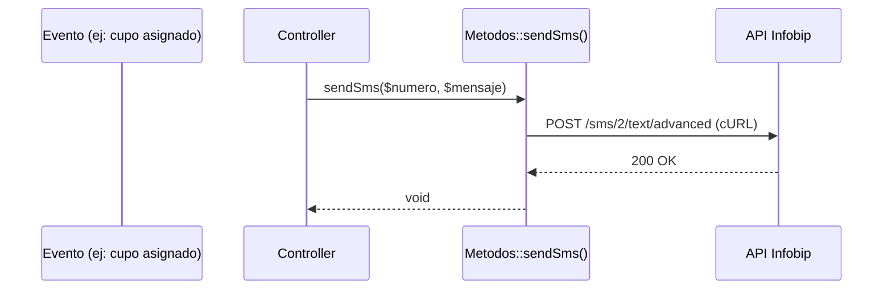

# Servicio de Notificaciones

> **Última revisión:** 2026-04-21
> **Ver también:** [[modulo-bot]], [[servicio-queue]], [[security-inventory]]

---

## Descripción

El sistema envía notificaciones a choferes y actores del sistema a través de múltiples canales: **SMS (Infobip)**, **WhatsApp (ChatBot)** y **notificaciones push** internas.

---

## Canal 1 — SMS via Infobip

### Implementación

Ubicada en `common/components/Metodos.php`, la función de SMS usa cURL directo a la API de Infobip:

```php
// Fragmento de common/components/Metodos.php
$auth = Yii::$app->params['infobip_auth'];
$to_sms = "549" . $numbers;   // Prefijo Argentina
$text_sms = $message;

curl([
    CURLOPT_URL => Yii::$app->params['infobip_url'],
    CURLOPT_HTTPHEADER => ['Authorization: ' . $auth, 'Content-Type: application/json'],
    CURLOPT_POSTFIELDS => '{ "messages": [ { "destinations": [ { "to": "' . $to_sms . '" } ], "from": "InfoSMS", "text": "' . $text_sms . '" } ] }',
])
```

### Configuración en `params.php`

```php
'infobip_url'  => '<url-infobip>',   // URL endpoint Infobip
'infobip_auth' => '<Basic token>',   // Auth header
```

> [!warning] Seguridad
> Las credenciales de Infobip deben estar en `params-local.php` (no en el repo). Verificar que `params.php` del repo NO contiene la auth real. Ver [[security-inventory]].

---

## Canal 2 — WhatsApp via ChatBot

Ver documento dedicado: [[modulo-bot]].

El flujo de mensajes WhatsApp es gestionado por `ChatBotController.php` y `MessengerController.php` usando la API de WhatsApp Business (vía Infobip o gateway propio).

---

## Canal 3 — Notificaciones internas (BD)

Los modelos `NotificacionesCentroCliente`, `NotificacionCupera`, `NotificacionesRemitentes` y `NotificacionesTipo` almacenan notificaciones en base de datos que el frontend lee por polling o websocket.

| Modelo | Tabla | Propósito |
|--------|-------|-----------|
| `NotificacionesCentroCliente` | `notificaciones_centro_cliente` | Notifs para operadores de centro |
| `NotificacionCupera` | `notificacion_cupera` | Notifs del sistema cupero |
| `NotificacionesRemitentes` | `notificaciones_remitentes` | Notifs para remitentes |
| `NotificacionesTipo` | `notificaciones_tipo` | Catálogo de tipos de notificación |

---

## Canal 4 — WebSocket (Socket.IO / ElephantIO)

El cliente ElephantIO está **vendorizado localmente** en `backend/ElephantIO/` (no instalado via Composer).

Se usa para notificaciones en tiempo real a los clientes conectados.

> [!danger] Riesgo
> `ElephantIO` sin control de versión Composer → imposible rastrear versión exacta ni aplicar parches de seguridad. Ver [[deuda-tecnica]].

---

## Controladores de notificaciones

| Controlador | Propósito |
|-------------|-----------|
| `GrupoNotificacionesController.php` | Gestión de grupos de notificación |
| `NotificacionesCentroClienteController.php` | CRUD de notificaciones centro-cliente |
| `NotificacionesTipoAcopladoController.php` | Notificaciones por tipo de acoplado |
| `MessengerController.php` | Envío de mensajes WhatsApp/chat |
| `ChatBotController.php` | Lógica del bot conversacional |

---

## Diagrama de flujo de notificación SMS



> [!note] Sin cola para SMS
> El envío de SMS es **síncrono** (no usa yii2-queue), lo que puede agregar latencia al request si Infobip es lento.
