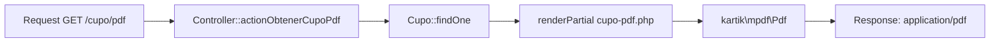

# Servicio PDF y Excel

> **Última revisión:** 2026-04-21
> **Ver también:** [[modulo-fertilizantes]], [[modulo-choferes]], [[reports-and-wizards-inventory]]

---

## Descripción

El sistema genera documentos PDF y hojas de cálculo Excel en varios contextos: documentación de choferes, reportes de cupos, cartas de porte y listados de turneada.

---

## Librería PDF — kartik-v/yii2-mpdf

Wrapper de Yii2 para **mPDF** (`mpdf/mpdf`).

### Uso

```php
use kartik\mpdf\Pdf;

$pdf = new Pdf([
    'mode'    => Pdf::MODE_UTF8,
    'format'  => Pdf::FORMAT_A4,
    'orientation' => Pdf::ORIENT_PORTRAIT,
    'content' => $this->renderPartial('_pdf', ['model' => $model]),
]);
return $pdf->render();
```

### Archivos de vista PDF

Las vistas utilizadas para generar PDFs se encuentran en `backend/views/`. El contenido se renderiza con `renderPartial()` y luego se convierte a PDF en memoria.

---

## Librería Excel — phpoffice/phpspreadsheet 1.18.0

Usada para generar y leer archivos `.xlsx`.

### Uso típico

```php
use PhpOffice\PhpSpreadsheet\Spreadsheet;
use PhpOffice\PhpSpreadsheet\Writer\Xlsx;

$spreadsheet = new Spreadsheet();
$sheet = $spreadsheet->getActiveSheet();
$sheet->setCellValue('A1', 'Columna 1');

$writer = new Xlsx($spreadsheet);
$writer->save('php://output');
```

### Uso en Fertilizantes (bypass CORS)

En `backend/modules/fertilizantes/controllers/`, la descarga de Excel usa `header()` directo:

```php
header('Content-Type: application/vnd.openxmlformats-officedocument.spreadsheetml.sheet');
header('Content-Disposition: attachment; filename="reporte.xlsx"');
```

> [!warning] CORS issue
> Los endpoints que generan Excel con `header()` directo **no pasan por el filtro CORS** de Yii2 y pueden tener problemas cross-origin. Ver [[security-inventory]].

---

## Conversión PDF a imagen — spatie/pdf-to-image

Usada para convertir páginas de PDF en imágenes (`spatie/pdf-to-image ^2.1`).

### Dependencia externa

Requiere **Ghostscript** o **Imagick** instalado en el sistema operativo.

> [!warning] Dependencia de SO
> En Docker, Imagick/Ghostscript debe estar instalado en la imagen. Verificar el Dockerfile.

---

## Controladores que generan documentos

| Controlador | Tipo | Propósito |
|-------------|------|-----------|
| `DocumentacionChoferController.php` | PDF | PDFs de documentación del chofer |
| `DocumentoController.php` | PDF/Excel | Documentos generales |
| `EstandarController.php` | PDF | Estándares de calidad |
| `ManualController.php` | PDF | Manuales de usuario |
| `BusquedaTipoAcopladoController.php` | Excel | Reportes de búsqueda |
| `CupoController.php` | PDF | PDF del cupo (actionObtenerCupoPdf) |
| `modules/fertilizantes/*` | Excel | Reportes de fertilizantes |
| `ApiUsuarioController.php` | Excel/PDF | Exportaciones de usuarios |
| `OperadorController.php` | PDF | Reportes del operador |
| `CamionController.php` | PDF | Documentación de camiones |
| `ChoferAppController.php` | PDF | App de chofer PDF |
| `ConcursoController.php` | PDF/Excel | Reportes de concurso |

---

## Flujo de generación PDF


