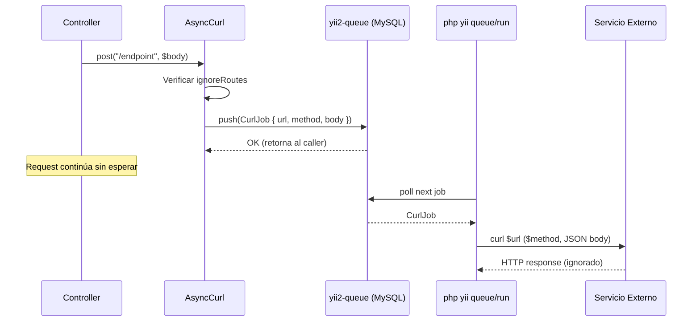

# Servicio de Cola (Queue) — Operaciones Asíncronas

> **Última revisión:** 2026-04-21
> **Ver también:** [[servicio-notificaciones]], [[servicio-integracion-afip]], [[stack-tecnologico]]

---

## Descripción

El sistema utiliza **yii2-queue ^2.3.7** con backend de MySQL para ejecutar operaciones que no deben bloquear el request HTTP principal:

- Peticiones HTTP a servicios externos (Gateway API, logs)
- Notificaciones SMS/Push
- Sincronización con servicios externos

---

## Componentes

| Componente | Rol |
|-----------|-----|
| `yii\queue\db\Queue` | Driver MySQL de yii2-queue |
| `common/jobs/CurlJob.php` | Job para peticiones HTTP asíncronas |
| `common/components/AsyncCurl.php` | Wrapper que encola `CurlJob` |
| `console/controllers/` | Comando `queue/run` para procesar jobs |

---

## Configuración de la cola

La cola usa la tabla `{{%queue}}` en MySQL con mutex para evitar procesamiento duplicado:

```php
// backend/config/main.php (inferido)
'queue' => [
    'class' => \yii\queue\db\Queue::class,
    'db'    => 'db',
    'tableName' => '{{%queue}}',
    'channel' => 'default',
    'mutex' => \yii\mutex\MysqlMutex::class,
],
```

---

## CurlJob — Job de HTTP asíncrono



### Implementación

```php
// common/jobs/CurlJob.php
class CurlJob implements JobInterface {
    public $url;
    public $method;  // POST, GET, PUT...
    public $body;    // array → JSON

    public function execute($queue) {
        $ch = curl_init($this->url);
        curl_setopt($ch, CURLOPT_TIMEOUT, 10);
        curl_setopt($ch, CURLOPT_CUSTOMREQUEST, $this->method);
        curl_setopt($ch, CURLOPT_POSTFIELDS, json_encode($this->body));
        curl_exec($ch);
        curl_close($ch);
    }
}
```

---

## AsyncCurl — Wrapper de encolamiento

```php
// Uso típico en un Controller
Yii::$app->asyncCurl->post('/gateway/log', [
    'action' => 'asignar_cupo',
    'user_id' => $userId,
    'data' => $payload
]);
```

### `ignoreRoutes`

El componente tiene una lista de rutas que se ignoran al encolar (para evitar loops o rutas de bajo impacto):

```php
// En el componente AsyncCurl
public $ignoreRoutes = [/* rutas configuradas en main.php */];
```

---

## Ejecución del worker

```bash
# Ejecutar todos los jobs pendientes (one-shot)
php yii queue/run

# Modo daemon (escucha continuamente)
php yii queue/listen

# Ver jobs pendientes
php yii queue/info
```

El archivo `daemons-app.json` gestiona el proceso daemon con PM2 o similar.

---

## Notas de operación

> [!warning] Sin reintentos configurados
> `CurlJob` no implementa retry ni manejo de errores. Si el servicio externo falla, el job se pierde. Esto es intencional para logs no críticos, pero es un riesgo para integraciones críticas.

> [!tip] Escalar workers
> Para carga alta, se pueden lanzar múltiples instancias de `queue/listen`. El mutex MySQL garantiza que cada job se procese una sola vez.
