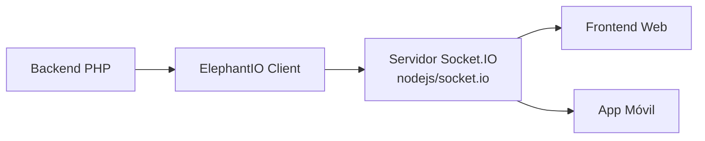

# Servicio WebSocket (Socket.IO / ElephantIO)

> **Última revisión:** 2026-04-21
> **Ver también:** [[modulo-viajes]], [[servicio-notificaciones]], [[deuda-tecnica]]

---

## Descripción

El sistema utiliza **WebSockets** para notificar eventos en tiempo real a los clientes frontend, especialmente para:

- Actualización de estado de cupos
- Notificaciones de asignación a choferes
- Eventos de tracking de viajes

---

## Implementación

La librería cliente usada es **ElephantIO**, un cliente PHP de Socket.IO:

| Item | Detalle |
|------|---------|
| Librería | ElephantIO (PHP client for Socket.IO) |
| Ubicación | `backend/ElephantIO/` (vendorizado localmente) |
| Versión | **Desconocida** — no en Composer |
| Control de versión | ❌ Ninguno |

---

## Riesgo de seguridad

> [!danger] Deuda técnica crítica
> `ElephantIO` está copiado directamente en el repositorio (`backend/ElephantIO/`) sin pasar por Composer. Esto significa:
> - No se puede rastrear la versión exacta
> - No se pueden aplicar parches de seguridad automáticamente
> - Puede contener vulnerabilidades sin parchear
> - No hay `composer.lock` para esta dependencia
> 
> **Acción recomendada:** Migrar a `elephantio/elephant.io` via Composer. Ver [[recomendaciones-modernizacion]].

---

## Diagrama conceptual



---

## Uso típico (inferido)

```php
use backend\ElephantIO\Client;
use backend\ElephantIO\Engine\SocketIO\Version2X;

$client = new Client(new Version2X('http://localhost:3000'));
$client->initialize();
$client->emit('cupo_actualizado', ['id' => $cupoId, 'estado' => $nuevoEstado]);
$client->close();
```

---

## Servidor Node.js

El componente servidor (Socket.IO en Node.js) es externo a este repositorio. El archivo `daemons-app.json` puede contener la configuración del proceso servidor.
