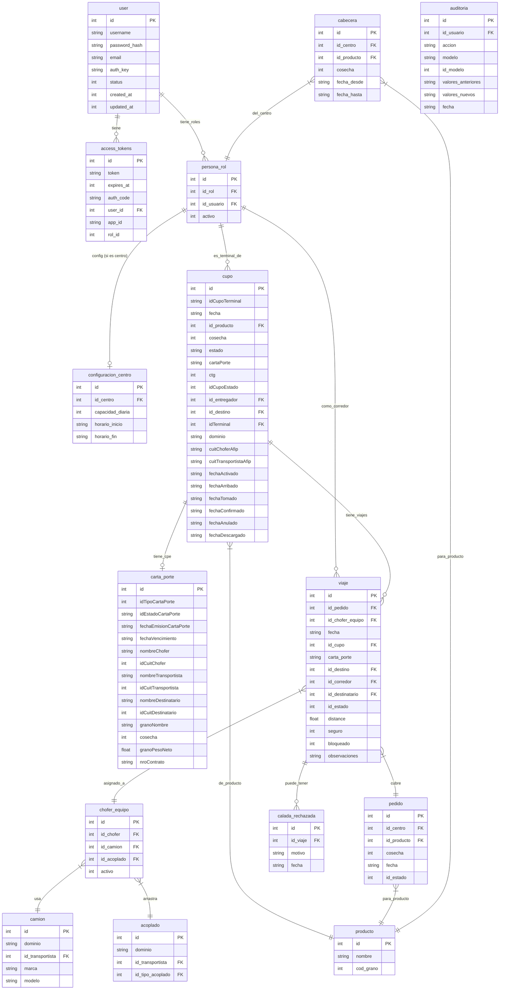

# Diagrama ER Global — Modelo de Datos

> **Última revisión:** 2026-04-21
> **Ver también:** [[_indice-entidades]], [[modulo-cupos]], [[modulo-viajes]], [[modulo-choferes]]

---

## Entidades core y sus relaciones



---

## Notas del modelo

### Polimorfismo en PersonaRol

`PersonaRol` actúa como tabla polimórfica: un mismo registro puede ser:
- Centro (`id_rol = 3`)
- Transportista (`id_rol = 4`)
- Corredor (`id_rol = 9`)
- Etc.

Los modelos específicos heredan de `PersonaRol`:
```
PersonaRol
├── Centro (ROL_CENTRO = 3)
└── (otros roles usan PersonaRol directamente)
```

### Convención de nombres mixta

El modelo tiene inconsistencia histórica en nombres de columnas:
- Algunas usan `camelCase`: `idCupoTerminal`, `idCupoEstado`
- Otras usan `snake_case`: `id_producto`, `id_destino`

Esto refleja el crecimiento orgánico del sistema a lo largo de años.

---

## Tablas de catálogo

| Tabla (modelo) | Propósito |
|---------------|-----------|
| `Producto` | Catálogo de granos y productos |
| `TipoProducto` | Tipos de producto |
| `ProductoCondicion` | Condiciones de calidad por producto |
| `Provincias` | Catálogo de provincias |
| `AfipLocalidades` | Localidades habilitadas AFIP |
| `TipoDespacho` | Tipos de despacho |
| `TipoInterviniente` | Tipos de actores en carta de porte |
| `MotivoAnularCupo` | Motivos de anulación |
| `MotivoAnularSolicitud` | Motivos de anulación de solicitudes |
| `MotivoRechazoDemandaCupo` | Motivos de rechazo de demanda |
| `MotivoRecuperarCupo` | Motivos de recuperación |
| `NotificacionesTipo` | Tipos de notificación |
| `MenuesByRol` | Menús por rol |
| `Modulos` | Catálogo de módulos |
