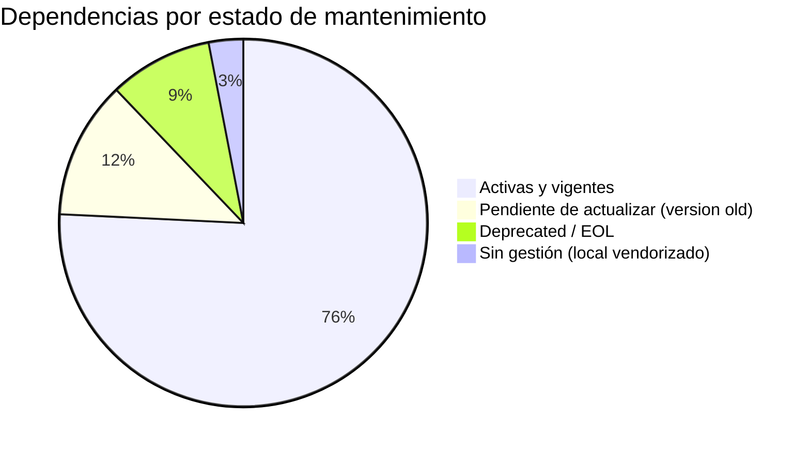

# Core vs. Dependencias Customizadas — Muvinapp

> **Última revisión:** 2026-04-21
> **Ver también:** [[stack-tecnologico]], [[deuda-tecnica]]

---

## Dependencias de Composer

### Core del framework (vendor nativo)

| Paquete | Versión | Categoría | Notas |
|---------|---------|-----------|-------|
| `yiisoft/yii2` | 2.0.48 | Core | EOL próximo |
| `yiisoft/yii2-bootstrap` | ~2.0 | Core | Views/assets |
| `yiisoft/yii2-swiftmailer` | ~2.0 / ~2.1 | Core | ⚠️ SwiftMailer deprecated |
| `yiisoft/yii2-queue` | ^2.3.7 | Core | Queue DB-backed |
| `bower-asset/jquery` | ~3.6.4 | Frontend | vía fxp/composer-asset-plugin |
| `bower-asset/inputmask` | ~3.3.11 | Frontend | |

### Seguridad y autenticación

| Paquete | Versión | Categoría | Notas |
|---------|---------|-----------|-------|
| `firebase/php-jwt` | 6.4 | Auth | JWT encode/decode |
| `paragonie/random_compat` | ~2.0 | Compat | PHP5 random_bytes backport |

### Generación de documentos

| Paquete | Versión | Categoría | Notas |
|---------|---------|-----------|-------|
| `kartik-v/yii2-mpdf` | * | PDF | mPDF wrapper |
| `mpdf/mpdf` | * | PDF | Dependencia de kartik-v |
| `phpoffice/phpspreadsheet` | 1.18.0 | Excel | v2.x disponible |
| `spatie/pdf-to-image` | * | PDF→img | |
| `setasign/fpdf` | * | PDF (FPDF) | |
| `setasign/fpdi` | * | PDF import | |

### HTTP y networking

| Paquete | Versión | Categoría | Notas |
|---------|---------|-----------|-------|
| `linslin/yii2-curl` | * | HTTP Client | Para integraciones externas |
| `symfony/http-foundation` | * | HTTP | Request/Response |
| `symfony/event-dispatcher` | * | Events | |

### Utilidades

| Paquete | Versión | Categoría | Notas |
|---------|---------|-----------|-------|
| `cebe/markdown` | * | Markdown | |
| `ezyang/htmlpurifier` | * | Security | Sanitización HTML de inputs |
| `egulias/email-validator` | * | Validation | |
| `doctrine/inflector` | * | String | |
| `spatie/array-to-xml` | * | Utils | |
| `maennchen/zipstream-php` | * | Zip | |

### API Docs

| Paquete | Versión | Categoría | Notas |
|---------|---------|-----------|-------|
| `light/yii2-swagger` | 3.0.2 | Swagger UI | OpenAPI 3.0 |
| `zircote/swagger-php` | * | Annotations | Genera spec desde annotations |

### Testing

| Paquete | Versión | Categoría | Notas |
|---------|---------|-----------|-------|
| `yiisoft/yii2-debug` | ~2.0 | Dev | |
| `yiisoft/yii2-gii` | ~2.0 | Dev | Generador de código |
| `yiisoft/yii2-faker` | ~2.0 | Test | Datos falsos |
| `fakerphp/faker` | * | Test | Base Faker |
| `phpspec/prophecy` | * | Test | Mocking |
| `myclabs/deep-copy` | * | Utils | |

---

## Código customizado en `common/components/`

| Componente | Propósito | Depende de |
|-----------|-----------|------------|
| `IntegracionAfip` | Integración AFIP Stop/CTG | `linslin/yii2-curl` |
| `StopConnect` | Conexión STOP (CTG) | HTTP |
| `MtrConnect` | Conexión MTR/MATba | HTTP |
| `BusIntegracion` | Bus integración VTerra | HTTP |
| `AsyncCurl` | Log asíncrono al Gateway | `linslin/yii2-curl` |
| `MicroServicioRbac` | Proxy RBAC | HTTP |
| `PdfResources` | Generación PDFs negocio | `kartik-v/yii2-mpdf` |
| `GenerarExcel` | Generación Excel negocio | `phpoffice/phpspreadsheet` |
| `Socket` | Cliente WebSocket/Socket.IO | `ElephantIO` (local) |
| `Notificacion` | Envío notificaciones push | `Socket`, `Infobip`, `WhatsApp` |
| `CheckAccess` | RBAC check personalizado | `MicroServicioRbac` |
| `UserComponent` | Identity provider | `AccessTokens` model, JWT |
| `ControllerHelpersTrait` | Helpers para controladores | Yii2 core |

---

## Código no gestionado por Composer (riesgo alto)

| Código | Ubicación | Razón del riesgo |
|--------|-----------|------------------|
| **ElephantIO** | `backend/ElephantIO/` | Versión desconocida, sin actualizaciones, sin trazabilidad de seguridad |

---

## Resumen de superficies de actualización

| Estado | Acción recomendada |
|--------|-------------------|
| 🔴 PHP 7.4 EOL | Actualizar a PHP 8.1+ (ver [[recomendaciones-modernizacion]]) |
| 🔴 SwiftMailer deprecated | Migrar a `symfony/mailer` o `symfony/swiftmailer` |
| 🔴 ElephantIO local | Reemplazar por `workerman/phpsocket.io` vía Composer o gestionar con tag git |
| 🟡 phpspreadsheet 1.18 | Actualizar a 2.x cuando sea posible |
| 🟡 Yii2 2.0.48 | Evaluar migración a Yii3 o framework moderno a largo plazo |
