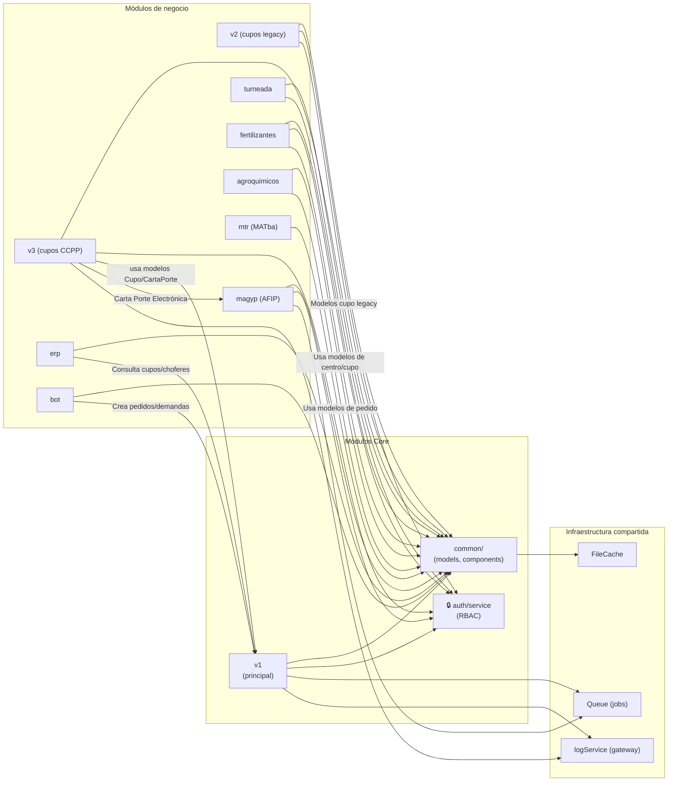

# Dependencias Entre Módulos — Muvinapp

> **Última revisión:** 2026-04-21
> **Ver también:** [[arquitectura-alto-nivel]], [[depends-matrix]]

---

## Mapa de dependencias

---

## Dependencias transitivas críticas

| Si falla... | Se ven afectados... | Impacto |
|------------|---------------------|---------|
| `common/` (models) | Todos los módulos | 💀 Sistema caído |
| `auth/service` (RBAC) | Todos los módulos (autenticación) | 💀 Sistema caído |
| `MAGYP` / AFIP | `v3` (carta de porte), `MAGYP` | 🔴 No se pueden emitir cartas de porte |
| `Queue` | Jobs de notificaciones, AFIP | 🔴 Procesamiento asíncrono detenido |
| `Gateway API` (log) | Todos (solo log) | 🟡 Logs perdidos, operación continúa |
| `v1` controllers | `bot`, `erp` (consultas) | 🟡 Funcionalidades parciales afectadas |

---

## Módulos y sus dependencias a componentes common/

| Módulo | Componentes que usa |
|--------|-------------------|
| **v1 / v3** | `IntegracionAfip`, `StopConnect`, `PdfResources`, `GenerarExcel`, `Socket`, `Notificacion`, `AsyncCurl`, `MicroServicioRbac`, `GatewayLog` |
| **magyp** | `HttpClient`, `GatewayLog` |
| **mtr** | `MtrConnect`, `GatewayLog` |
| **bot** | `WhatsApp`, `Infobip`, `Socket` |
| **turneada** | `Notificacion`, modelos `Turneada*` |
| **fertilizantes** | Modelos `Cupo*`, `Centro*` |
| **erp** | Modelos varios |
| **queue jobs** | `IntegracionAfip`, `Notificacion`, `Socket` |

---

## Notas

- No se detectó uso de interfaces/contratos explícitos entre módulos — la comunicación es por instanciación directa de clases y consultas ActiveRecord.
- Los módulos NO se llaman entre sí directamente vía HTTP interno — comparten modelos de `common/`.
- El Bus de Integración (`BusIntegracion`) es el único mecanismo de comunicación asíncrona hacia sistemas externos (VTerra).
