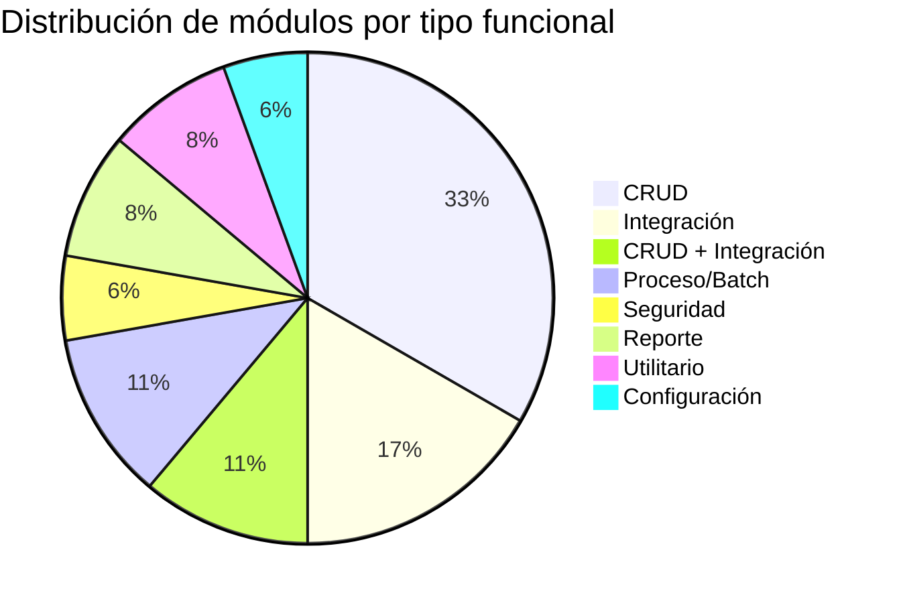
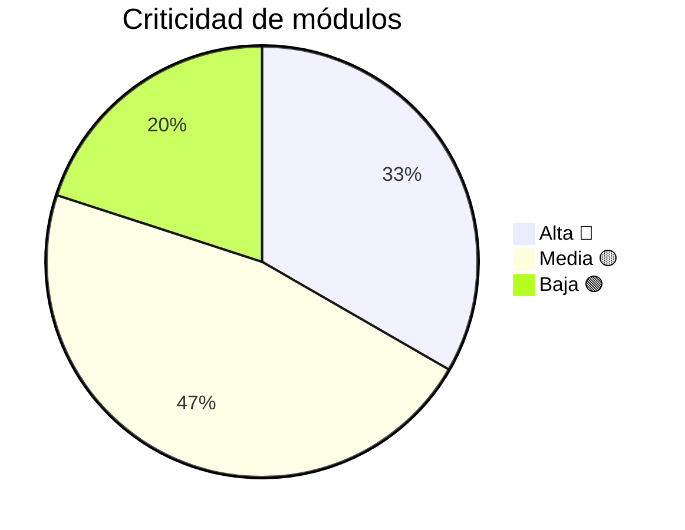

# Clasificación Funcional de Módulos — Muvinapp

> **Última revisión:** 2026-04-21
> **Ver también:** [[_indice-modulos]], [[cross-module-dependencies]]

---

## Tabla de clasificación

| # | Módulo/Dominio | Tipo funcional | Descripción breve | Criticidad |
|---|---------------|----------------|-------------------|-----------|
| 1 | **Cupos** | CRUD + Integración | Gestión del ciclo de vida de cupos de descarga | 🔴 Alta |
| 2 | **Carta de Porte (CCPP/AFIP)** | Integración + CRUD | Emisión y gestión de carta de porte electrónica vía AFIP | 🔴 Alta |
| 3 | **Choferes** | CRUD | Alta, gestión, estados, documentación y seguimiento de choferes | 🔴 Alta |
| 4 | **Viajes y Solicitudes** | CRUD + Proceso | Ciclo completo del viaje: pre-pedido → pedido → viaje → arribo | 🔴 Alta |
| 5 | **Autenticación y Permisos** | Seguridad | JWT, OAuth2, roles, RBAC, control de acciones | 🔴 Alta |
| 6 | **Centros/Terminales** | CRUD | Plantas, terminales, bocas de descarga y sus configuraciones | 🔴 Alta |
| 7 | **Actores del negocio** | CRUD | Dadores, corredores, transportistas, operadores, destinatarios | 🟡 Media |
| 8 | **Destinos y Zonas** | CRUD | Destinos, bocas, zonas geográficas, orígenes | 🟡 Media |
| 9 | **MAGYP** | Integración | Módulo especializado: autoridad sanitaria, cadena, carta de porte | 🔴 Alta |
| 10 | **MTR** | Integración | Integración MATba/Rofex: carátulas de mercado a término | 🟡 Media |
| 11 | **Turneada** | CRUD + Proceso | Gestión de turnos de descarga en terminales | 🟡 Media |
| 12 | **Fertilizantes** | CRUD + Integración | Cupos, novedades, proveedores y reservas de fertilizantes | 🟡 Media |
| 13 | **Agroquímicos** | CRUD | Pedidos de agroquímicos | 🟡 Media |
| 14 | **ERP** | Integración | Filtrado e integración con sistema ERP externo | 🟡 Media |
| 15 | **Bot / Chatbot** | Integración | Chatbot WhatsApp para operaciones de choferes | 🟡 Media |
| 16 | **Arribo y Calada** | Proceso | Arribes intermedios, caladas rechazadas, auditoría interna | 🔴 Alta |
| 17 | **Notificaciones y Comunicación** | Utilitario | Push notifications, SMS (Infobip), WhatsApp, Socket.IO | 🟡 Media |
| 18 | **Demandas de Cupo** | CRUD + Proceso | Demandas de cupo (V2/V3), carátulas, estados | 🔴 Alta |
| 19 | **Tracking y Mapas** | Reporte | Seguimiento en tiempo real, mapas de radar/talleres/oficinas | 🟡 Media |
| 20 | **V2 (legacy)** | CRUD legacy | API versión 2 — cupos, dashboard, asignación (legacy) | 🟡 Media |
| 21 | **V3 (actual)** | CRUD | API versión 3 — cupos CCPP, turnos, demandas | 🔴 Alta |
| 22 | **Configuración y Catálogos** | Configuración | Configuración del sistema, tipos, estados, estándares | 🟢 Baja |
| 23 | **Reportes y Documentos** | Reporte | PDFs de arribes, Excel de cupos, documentaciones | 🟡 Media |
| 24 | **Selects y Lookup** | Utilitario | Datos para dropdowns del frontend | 🟢 Baja |
| 25 | **Queue / Jobs** | Batch | Jobs asíncronos: AFIP, notificaciones, procesamiento batch | 🟡 Media |
| 26 | **Consola / Cron** | Batch | Cron jobs: AFIP, choferes, cupos, demandas | 🟡 Media |
| 27 | **Concursos y Promociones** | CRUD | Sorteos, concursos, ganadores | 🟢 Baja |
| 28 | **Lista Negra** | CRUD + Seguridad | Lista negra de actores del sistema | 🟡 Media |
| 29 | **Personas y Roles** | CRUD | Relación persona-usuario-rol, CUIT lookup | 🔴 Alta |
| 30 | **Swagger / Docs API** | Utilitario | Documentación OpenAPI autogenerada | 🟢 Baja |

---

## Distribución por tipo funcional

---

## Distribución por criticidad

---

## Notas metodológicas

- La clasificación es funcional, no estructural. Algunos módulos aparecen en múltiples controladores distribuidos entre `backend/controllers/` y `backend/modules/`.
- Los módulos de tipo **Integración** son los de mayor riesgo operacional porque dependen de servicios externos con disponibilidad variable (AFIP, MTR, Stop).
- Los módulos **Batch/Cron** se ejecutan fuera del ciclo request-response web — ver `console/controllers/`.
