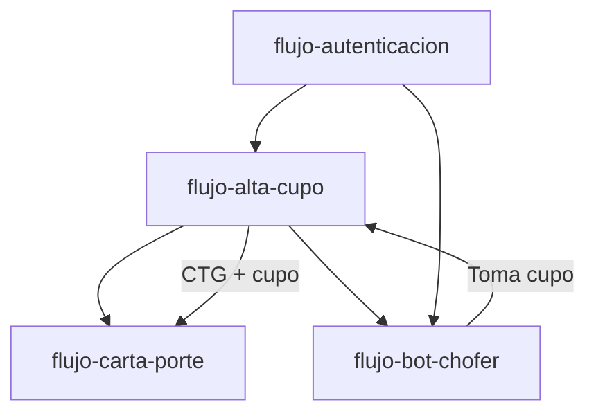

# Índice de Flujos Transversales

> **Última revisión:** 2026-04-21
> **Ver también:** [[_indice-modulos]], [[arquitectura-alto-nivel]]

---

## Flujos documentados

| Flujo | Archivo | Módulos involucrados |
|-------|---------|---------------------|
| Alta y ciclo de vida del cupo | [[flujo-alta-cupo]] | v3, cupos, AFIP, SMS |
| Emisión de Carta de Porte | [[flujo-carta-porte]] | v3, AFIP, CartaPorte |
| Autenticación JWT | [[flujo-autenticacion]] | auth, JWT, RBAC |
| Bot WhatsApp de choferes | [[flujo-bot-chofer]] | bot, messenger, WhatsApp |

---

## Relación entre flujos

## Flujos pendientes de documentar

- `flujo-asignacion-cupo.md` — Asignación manual vs. inteligente (postulación)
- `flujo-calada.md` — Proceso de pesaje y muestreo en destino
- `flujo-turneada.md` — Sistema de turnos de ingreso a terminales
- `flujo-notificaciones.md` — Ciclo completo de notificaciones
- `flujo-sync-erp.md` — Sincronización con ERP via Bus Integración
