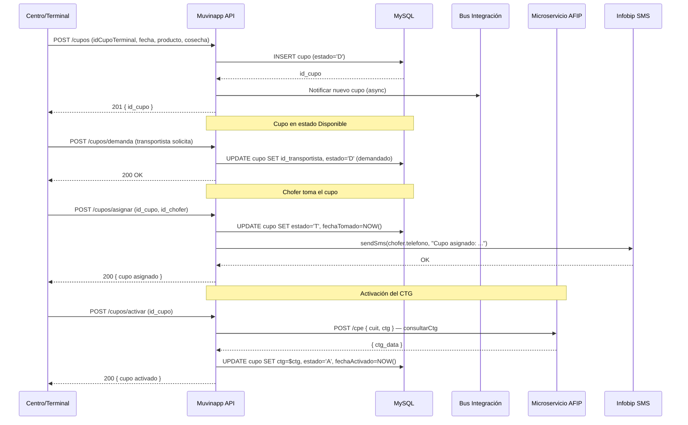
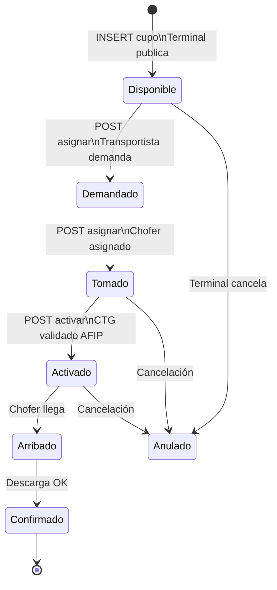

# Flujo: Alta de Cupo

> **Última revisión:** 2026-04-21
> **Ver también:** [[flujo-carta-porte]], [[modulo-v3]], [[modulo-cupos]], [[servicio-integracion-afip]]

---

## Descripción

El flujo de **alta de cupo** describe el proceso completo desde que una terminal publica un cupo hasta que está disponible para ser tomado por un transportista/chofer. Es el flujo más crítico del sistema.

---

## Actores involucrados

| Actor | Rol |
|-------|-----|
| Centro/Terminal | Publica el cupo |
| Corredor | (opcional) Intermedia la asignación |
| Transportista | Demanda el cupo |
| Chofer | Toma el cupo y ejecuta el viaje |
| AFIP/STOP | Valida el CTG |

---

## Diagrama de flujo completo

---

## Estados del cupo en este flujo

---

## Endpoints involucrados (v3)

| Paso | Método | Ruta | Controlador |
|------|--------|------|-------------|
| Crear cupo | POST | `/v3/cupos` | `v3/CupoController::actionCreate` |
| Listar disponibles | GET | `/v3/cupos/disponibles` | `v3/CupoController::actionDisponibles` |
| Asignar | POST | `/v3/cupos/asignar` | `v3/CupoController::actionAsignar` |
| Activar | POST | `/v3/cupos/activar` | `v3/CupoController::actionActivar` |
| Anular | POST | `/v3/cupos/anular` | `v3/CupoController::actionAnularCupo` |

---

## Validaciones de negocio

1. El cupo debe tener `idCupoTerminal` único por terminal
2. El chofer debe estar activo y con documentación vigente
3. El camión debe tener habilitación vigente
4. El CTG de AFIP debe coincidir con los datos del cupo
5. La fecha del cupo no puede ser pasada al momento de tomar

---

## Notas de implementación

> [!note] Caratula v3
> En módulo v3, el cupo tiene asociada una **caratula** que contiene datos comerciales (corredor vendedor, comprador, condición, contrato). Esto agrega una capa de validación adicional antes de activar.

> [!warning] CupoController tamaño
> `v3/CupoController.php` tiene 5,754+ líneas. Toda la lógica de negocio del cupo está en un solo controlador sin separación de capas. Ver [[hotspots]].
