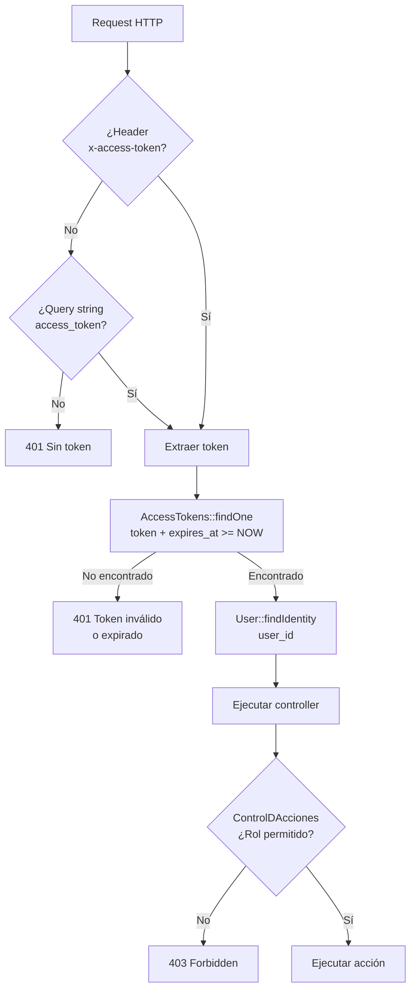

# Flujo: Autenticación JWT

> **Última revisión:** 2026-04-21
> **Ver también:** [[servicio-jwt]], [[modulo-auth]], [[security-inventory]]

---

## Descripción

El flujo de autenticación cubre desde el login inicial hasta la verificación de permisos por rol en cada request.

---

## Flujo de login

```mermaid
flowchart TD
    A[Cliente envía\nPOST /login] --> B{Validar username\n+ password}
    B -- Inválido --> ERR1[401 Credenciales\ninválidas]
    B -- Válido --> C[findByUsername]
    C --> D[validatePassword\nbcrypt]
    D -- Falla --> ERR1
    D -- OK --> E[JWT::encode\nHS256 + secret]
    E --> F[INSERT access_tokens\ntoken, user_id, rol_id,\nexpires_at, app_id]
    F --> G[200 { token,\nexpires_at, roles }]
```

---

## Flujo de request autenticado



---

## Verificación de rol

Cada controller define sus reglas de acceso usando `AccessRuleMuvin`:

```php
// Ejemplo en un controller
public function behaviors() {
    return [
        'access' => [
            'class' => ControlDAcciones::class,
            'rules' => [
                [
                    'allow' => true,
                    'actions' => ['index', 'view'],
                    'roles' => ['administrador', 'centro', 'operador'],
                ],
                [
                    'allow' => true,
                    'actions' => ['asignar'],
                    'roles' => ['transportista', 'corredor'],
                ],
            ],
        ],
    ];
}
```

`AccessRuleMuvin::matchRole()` convierte el nombre de rol al ID numérico y verifica via `$user->existRolById($id)`.

---

## Token refresh

No hay endpoint OAuth estándar de refresh. El frontend debe hacer login nuevamente cuando el token expira.

> [!warning] Sin refresh token
> La ausencia de refresh tokens implica que los usuarios deben re-autenticarse cuando el JWT expira. Ver [[recomendaciones-modernizacion]].

---

## Multi-rol

Un usuario puede tener múltiples roles (múltiples filas en `persona_rol`). El `access_token` tiene un `rol_id` que indica el rol activo en esa sesión.

---

## Expiración

| Parámetro | Valor (config) |
|-----------|---------------|
| `expires_at` | Timestamp Unix configurado en `params.php` |
| Algoritmo | HS256 |
| Librería | `firebase/php-jwt ^6.4` |

---

## Endpoints de autenticación

| Método | Ruta | Controller |
|--------|------|------------|
| POST | `/login` | `LoginController::actionIndex` |
| POST | `/logout` | `LoginController::actionLogout` |
| POST | `/refresh-token` | (si existe) `TokenController` |
| POST | `/change-password` | `ChangePasswordController` |
| POST | `/forgot-password` | `ForgotPasswordController` |
