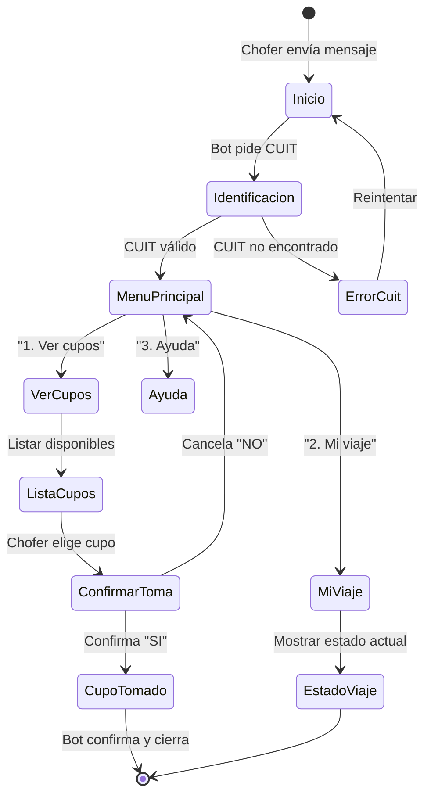
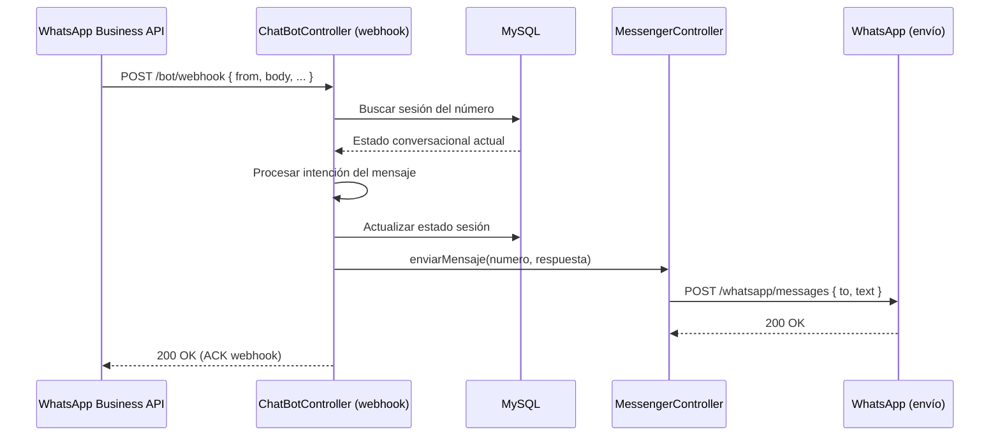

# Flujo: Bot Chofer (WhatsApp)

> **Última revisión:** 2026-04-21
> **Ver también:** [[modulo-bot]], [[flujo-alta-cupo]], [[servicio-notificaciones]]

---

## Descripción

El **Bot de WhatsApp** permite a los choferes operar el sistema (ver cupos disponibles, tomar un cupo, consultar estado del viaje) sin necesidad de la app móvil, a través de mensajes de texto en WhatsApp.

---

## Actores

| Actor | Rol |
|-------|-----|
| Chofer | Usuario final del bot |
| WhatsApp Business API | Canal de comunicación |
| ChatBotController | Procesador de mensajes entrantes |
| MessengerController | Envío de mensajes de respuesta |
| Cupo | Entidad sobre la que opera |

---

## Flujo conversacional principal

---

## Flujo técnico de procesamiento de mensaje

---

## Configuración del bot

Los parámetros del bot se gestionan via `ParametrosChatController`:

| Parámetro | Propósito |
|-----------|-----------|
| Mensaje de bienvenida | Texto inicial del bot |
| Tiempo de sesión | Timeout de conversación |
| Número WhatsApp | Número origen del bot |
| Token API | Auth hacia WhatsApp Business |
| Productos disponibles | Qué granos puede operar via bot |

---

## Limitaciones conocidas

> [!warning] Sin persistencia de estado robusta
> El estado conversacional se guarda en BD, lo que puede ser lento para conversaciones con muchos turnos. Un Redis o sistema de sesiones más eficiente sería ideal.

> [!note] Dependencia de WhatsApp Business API
> Si cambia el proveedor de WhatsApp (ej: de Infobip a Twilio), requiere modificar `MessengerController` y la configuración de webhooks.
