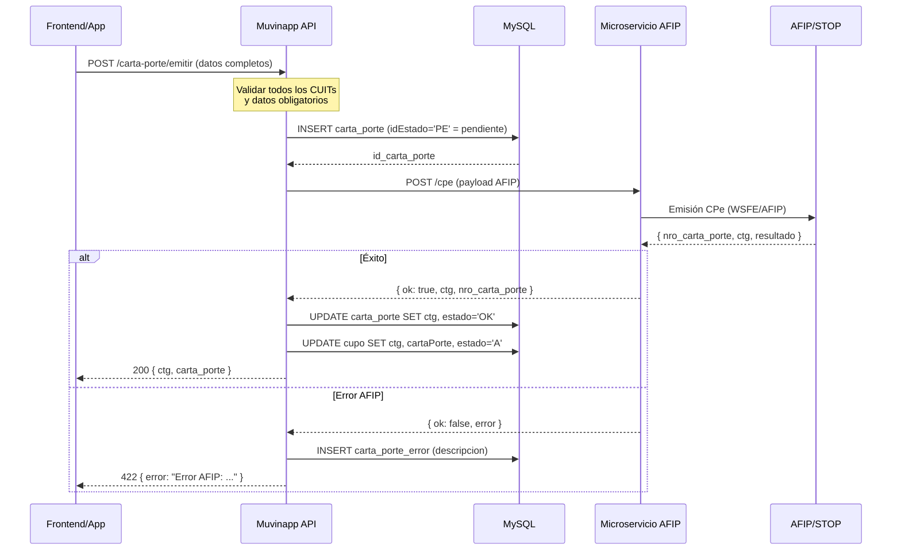
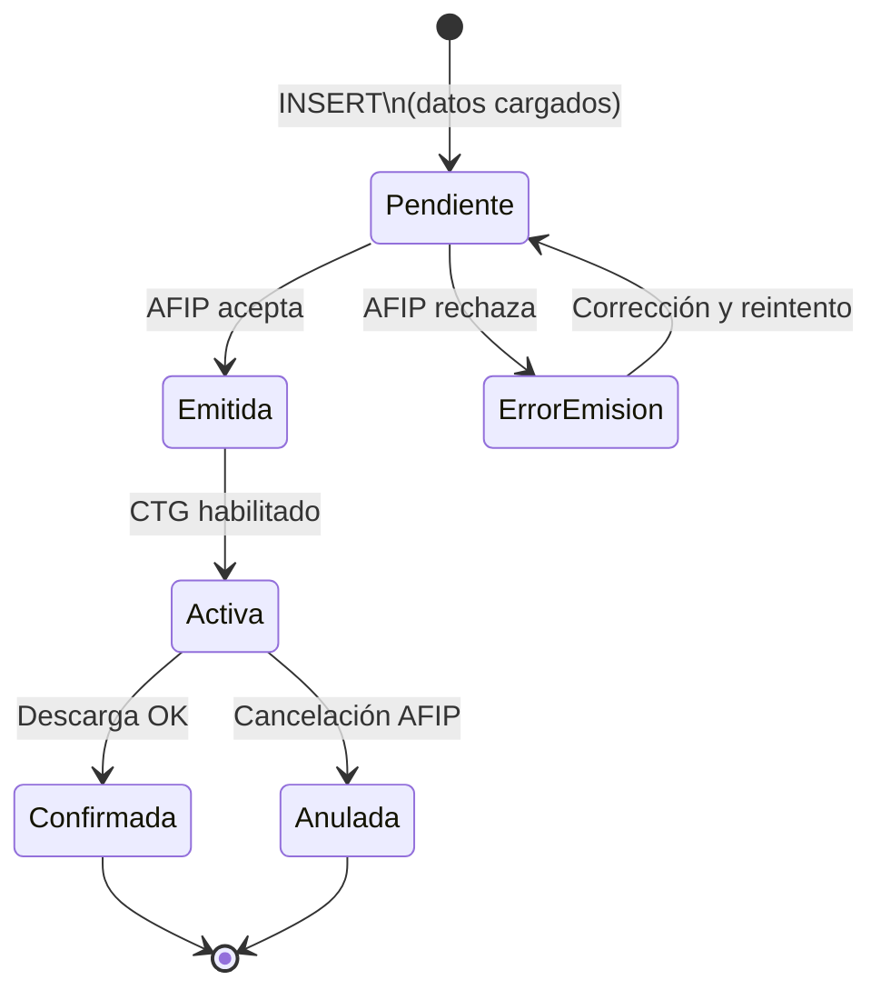
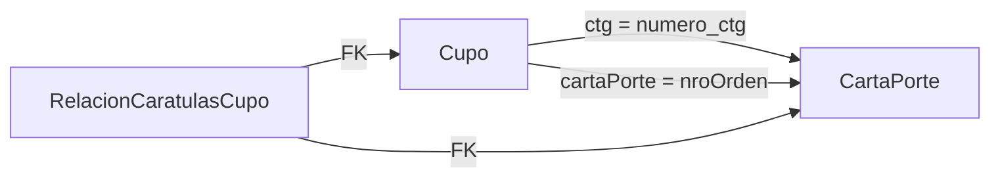

# Flujo: Carta de Porte Electrónica (CPe)

> **Última revisión:** 2026-04-21
> **Ver también:** [[flujo-alta-cupo]], [[servicio-integracion-afip]], [[modulo-v3]], [[glosario]]

---

## Descripción

La **Carta de Porte Electrónica (CPe)** es el documento obligatorio de AFIP que debe acompañar todo transporte de granos. Es el nexo legal entre el cupo de la terminal y el viaje físico del camión.

Desde la **Resolución AFIP 5017/2021**, la CPe es obligatoria para todo el tráfico de granos en Argentina.

---

## Actores

| Actor | Rol en CPe |
|-------|-----------|
| Remitente Comercial | Emisor de la CPe |
| Destinatario | Receptor de la carga |
| Transportista | Responsable del transporte |
| Chofer | Conductor con CUIT |
| Corredor | Intermediario registrado |
| AFIP | Organismo validador |

---

## Flujo de emisión

---

## Campos obligatorios del modelo CartaPorte

| Grupo | Campos clave |
|-------|-------------|
| **Titular/Emisor** | `idCuitTitula`, `nombreTitular` |
| **Remitente** | `idCuitRemComercial`, `nombreRemitente` |
| **Destinatario** | `idCuitDestinatario`, `nombreDestinatario` |
| **Transportista** | `idCuitTransportista`, `nombreTransportista` |
| **Chofer** | `idCuitChofer`, `nombreChofer` |
| **Destino** | `idCuitDestino`, `nombreDestino` |
| **Grano** | `granoNombre`, `cosecha`, `granoPesoNeto`, `granoKgEstimado` |
| **Procedencia** | `procedenciaEstablecimiento`, `procedenciaDireccion`, `procedenciaLocalidad` |
| **Fechas** | `fechaEmisionCartaPorte`, `fechaVencimientoCartaPorte` |
| **Contrato** | `nroContrato` (opcional para mercado a término) |

---

## Ciclo de vida de la CPe

---

## Entidades de error

| Modelo | Tabla | Propósito |
|--------|-------|-----------|
| `CartaPorteError` | `carta_porte_error` | Error al emitir una CPe |
| `CartaPorteErrorDescripcion` | `carta_porte_error_descripcion` | Descripción detallada del error |

---

## Intervinientes múltiples

El modelo `CartaPorteInterviniente` permite registrar múltiples actores en una sola CPe (intermediarios de flete, remitentes de venta primaria/secundaria, etc.):

| Campo | Descripción |
|-------|-------------|
| `idCuitCorredorVentaPrimaria` | Corredor en venta primaria |
| `idCuitCorredorVentaSecundaria` | Corredor en venta secundaria |
| `idCuitRemComercialVentaPrimaria` | Remitente venta primaria |
| `idCuitIntermediarioFlete` | Intermediario de flete |
| `idCuitMercadoATermino` | Mercado a término (MTR) |

---

## Relación con el Cupo

La tabla `relacion_caratulas_cupo` vincula la caratula AFIP previa con el cupo y la carta de porte resultante.
