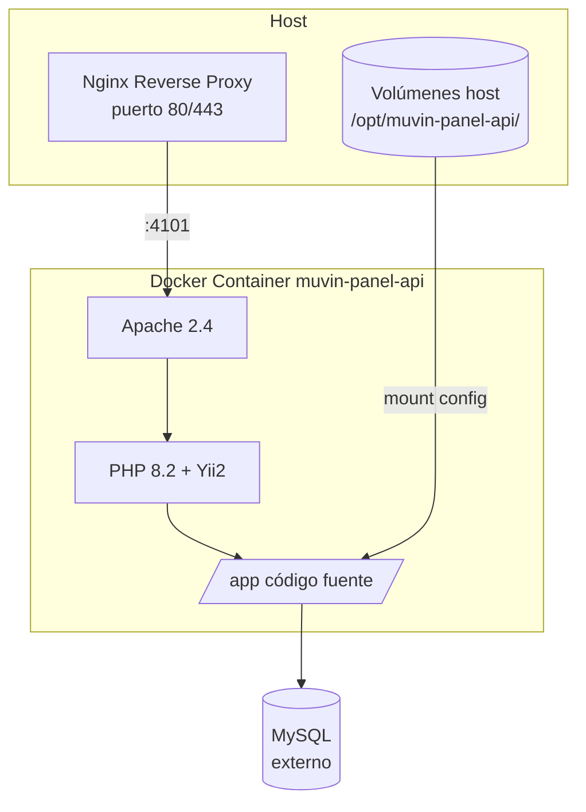

# Operación y Despliegue

> **Última revisión:** 2026-04-21
> **Ver también:** [[stack-tecnologico]], [[recomendaciones-modernizacion]]

---

## Arquitectura de contenedores

El sistema se despliega como un **único contenedor Docker** (Apache + PHP-FPM) expuesto en el puerto 4101 por defecto.



---

## Variables de entorno y configuración

| Variable | Default | Descripción |
|---------|---------|-------------|
| `ENV` | `prod` | Entorno: `dev`, `qa`, `prod` |
| `APP_PORT` | `4101` | Puerto expuesto del contenedor |
| `DOCKER_REGISTRY` | — | Registry de Docker (GitLab/DockerHub) |
| `IMAGE_TAG` | `cap` | Tag de la imagen a usar |

---

## Volúmenes montados en producción

| Host path | Container path | Propósito |
|-----------|---------------|-----------|
| `/opt/muvin-panel-api/backend/config/main-local.php` | `/app/backend/config/main-local.php` | Config local del backend |
| `/opt/muvin-panel-api/common/config/main-local.php` | `/app/common/config/main-local.php` | Config local del common |
| `/opt/muvin-panel-api/params.php` | `/app/params.php` | Credenciales y parámetros |
| `/opt/muvin-panel-api/apache-vhost.conf` | `/etc/apache2/sites-available/000-default.conf` | VirtualHost Apache |

> [!important] Secretos
> Las credenciales de producción (DB, AFIP, Infobip, tokens) se gestionan via `params.php` montado como volumen. Este archivo **nunca debe estar en el repositorio**.

---

## Construcción multi-stage de Docker

```dockerfile
# Stage 1: Builder — instala dependencias Composer
FROM yiisoftware/yii2-php:8.2-apache AS builder
RUN composer install --ignore-platform-reqs

# Stage 2: Imagen final
FROM yiisoftware/yii2-php:8.2-apache
COPY --from=builder /app/vendor ./vendor
COPY . .
```

**Nota:** El `Dockerfile` usa PHP 8.2 aunque el codebase fue desarrollado para PHP 7.4. Verificar que no hay incompatibilidades en producción.

---

## Comandos de despliegue

```bash
# Construir imagen
ENV=prod docker compose build

# Levantar el contenedor
ENV=prod docker compose up -d

# Con puerto personalizado
APP_PORT=4200 docker compose up -d

# Ver logs
docker compose logs -f muvin-api

# Reiniciar
docker compose restart muvin-api

# Actualizar imagen desde registry
docker compose pull && docker compose up -d
```

---

## Health check

Docker verifica la salud del contenedor cada 30 segundos:

```yaml
healthcheck:
  test: ["CMD", "curl", "-f", "http://localhost/"]
  interval: 30s
  timeout: 10s
  retries: 3
```

Si el contenedor falla 3 veces, Docker lo marca como `unhealthy` y puede reiniciarlo (con `restart: unless-stopped`).

---

## Comandos de mantenimiento (consola)

```bash
# Ejecutar migraciones pendientes
docker exec muvin-panel-api php /app/yii migrate/up --interactive=0

# Ver migraciones aplicadas
docker exec muvin-panel-api php /app/yii migrate/history

# Procesar cola de trabajos
docker exec muvin-panel-api php /app/yii queue/run

# Ver estado de la cola
docker exec muvin-panel-api php /app/yii queue/info

# Limpiar cache
docker exec muvin-panel-api php /app/yii cache/flush-all
```

---

## Entornos

| Entorno | Puerto | Config | Propósito |
|---------|--------|--------|-----------|
| `dev` | configurable | `main-local.php` local | Desarrollo local |
| `qa` | configurable | `main-local.php` qa | QA/staging |
| `prod` | 4101 | `main-local.php` en `/opt/...` | Producción |

---

## Proceso de release

1. Merge a rama `main`/`master`
2. Pipeline CI/CD (GitLab CI o GitHub Actions) construye imagen
3. Push al Docker Registry
4. Deploy: `docker compose pull && docker compose up -d`
5. Verificar health check
6. Ejecutar migraciones si las hay
