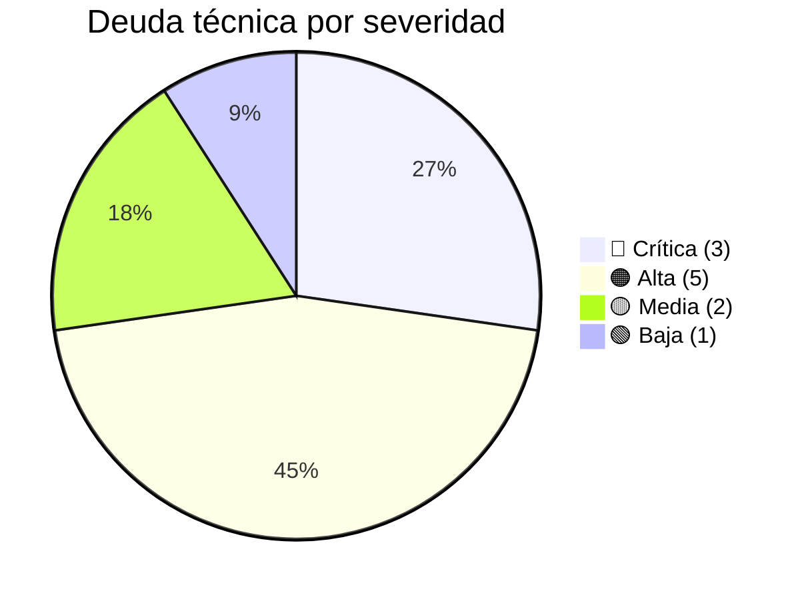

# Deuda Técnica

> **Última revisión:** 2026-04-21
> **Ver también:** [[hotspots]], [[recomendaciones-modernizacion]], [[security-inventory]]

---

## Catálogo de deuda técnica

### DT-001 — God Controller: v3/CupoController (5,754 líneas)

| Item | Detalle |
|------|---------|
| **Severidad** | 🔴 Crítica |
| **Tipo** | Diseño — falta de separación de capas |
| **Archivo** | `backend/modules/v3/controllers/CupoController.php` |
| **Impacto** | Alto riesgo de regresiones, imposible testear unitariamente, merge conflicts frecuentes |
| **Solución** | Extraer lógica de negocio a Services/UseCases, repositorios para queries |
| **Esfuerzo estimado** | Alto (2-4 sprints) |

---

### DT-002 — Ausencia de capa de servicios

| Item | Detalle |
|------|---------|
| **Severidad** | 🔴 Crítica |
| **Tipo** | Arquitectura |
| **Descripción** | Toda la lógica de negocio está en los Controllers. No hay capa Service/UseCase. Los Models (ActiveRecord) tienen algo de lógica pero los Controllers hacen el grueso |
| **Consecuencia** | Duplicación de código entre controllers, imposible reusar lógica, testabilidad nula |
| **Solución** | Introducir gradualmente `CupoService`, `ViajeService`, etc. comenzando por los módulos más cambiados |
| **Esfuerzo** | Alto (incremental, 4-8 sprints) |

---

### DT-003 — ElephantIO sin gestión de versión

| Item | Detalle |
|------|---------|
| **Severidad** | 🔴 Crítica |
| **Tipo** | Gestión de dependencias |
| **Archivo** | `backend/ElephantIO/` |
| **Impacto** | Versión desconocida, sin parches de seguridad, no auditada |
| **Solución** | `composer require elephantio/elephant.io`, eliminar directorio local |
| **Esfuerzo** | Bajo (1-2 días) |

---

### DT-004 — SwiftMailer archivado

| Item | Detalle |
|------|---------|
| **Severidad** | 🟠 Alta |
| **Tipo** | Dependencia deprecated |
| **Dependencia** | `yiisoft/yii2-swiftmailer ~2.0` |
| **Impacto** | Sin parches de seguridad desde 2021 |
| **Solución** | Migrar a `yiisoft/yii2-symfonymailer` |
| **Esfuerzo** | Medio (1 sprint) |

---

### DT-005 — PHP 7.4 fuera de soporte

| Item | Detalle |
|------|---------|
| **Severidad** | 🟠 Alta |
| **Tipo** | Runtime |
| **Impacto** | Sin parches de seguridad del lenguaje desde Nov 2022 |
| **Solución** | Migrar a PHP 8.1 o 8.2 |
| **Riesgo de migración** | Medio — Yii2 soporta PHP 8.x pero requiere testing |
| **Esfuerzo** | Medio (1-2 sprints para testing + fix de deprecations) |

---

### DT-006 — phpoffice/phpspreadsheet versión antigua (1.18.0)

| Item | Detalle |
|------|---------|
| **Severidad** | 🟠 Alta |
| **Tipo** | Dependencia desactualizada |
| **Impacto** | Vulnerabilidades de parsing de Excel, funcionalidades modernas no disponibles |
| **Solución** | `composer update phpoffice/phpspreadsheet` |
| **Esfuerzo** | Bajo (verificar breaking changes entre versiones) |

---

### DT-007 — Sin tests automatizados en controllers principales

| Item | Detalle |
|------|---------|
| **Severidad** | 🟠 Alta |
| **Tipo** | Calidad |
| **Descripción** | La carpeta `backend/tests/` existe pero la cobertura de controllers de negocio es mínima o nula |
| **Impacto** | Regressions silenciosas, miedo al cambio, QA manual costoso |
| **Solución** | Agregar tests de integración para flujos críticos (alta cupo, asignación, carta de porte) |
| **Esfuerzo** | Alto (continuo) |

---

### DT-008 — Módulo v2 sin plan de deprecación formal

| Item | Detalle |
|------|---------|
| **Severidad** | 🟡 Media |
| **Tipo** | Producto/Arquitectura |
| **Descripción** | El módulo v2 sigue activo pero es código legacy sin nuevas features. No hay fecha de corte ni comunicación a clientes |
| **Solución** | Definir fecha de fin de soporte v2, migrar clientes, eliminar módulo |
| **Esfuerzo** | Medio (coordinación con clientes + 1 sprint técnico) |

---

### DT-009 — ControlDAcciones con doble beforeAction

| Item | Detalle |
|------|---------|
| **Severidad** | 🟠 Alta |
| **Tipo** | Bug potencial |
| **Archivo** | `backend/behaviours/ControlDAcciones.php` |
| **Descripción** | Dos métodos `beforeAction` en la misma clase. PHP ejecuta solo el segundo (VerbFilter). El control de acceso RBAC del primer método nunca se ejecuta |
| **Solución** | Refactorizar en dos behaviours separados: uno para RBAC, otro para VerbFilter |
| **Esfuerzo** | Bajo (1-2 días + testing exhaustivo) |

---

### DT-010 — Migraciones sin squash (623+)

| Item | Detalle |
|------|---------|
| **Severidad** | 🟡 Media |
| **Tipo** | Operaciones / DX |
| **Descripción** | 623 migraciones en `console/migrations/`. Ejecutarlas todas en un entorno nuevo tarda tiempo considerable |
| **Solución** | Crear un snapshot de DB cada 6 meses + migrar solo desde el snapshot |
| **Esfuerzo** | Bajo (proceso de ops) |

---

### DT-011 — Código comentado en behaviours

| Item | Detalle |
|------|---------|
| **Severidad** | 🟢 Baja |
| **Tipo** | Code smell |
| **Archivos** | `Apiauth.php`, `ControlDAcciones.php` |
| **Descripción** | Bloques de `echo $var; exit;` y alternativas comentadas que añaden ruido |
| **Solución** | Limpieza de código muerto |
| **Esfuerzo** | Mínimo |

---

## Resumen por prioridad

| Prioridad | Items | Acción |
|-----------|-------|--------|
| 🔴 Inmediata | DT-001, DT-002, DT-003 | Próximo sprint |
| 🟠 Alta | DT-004, DT-005, DT-006, DT-007, DT-009 | Próximos 2 sprints |
| 🟡 Media | DT-008, DT-010 | Backlog priorizado |
| 🟢 Baja | DT-011 | Oportunista |
