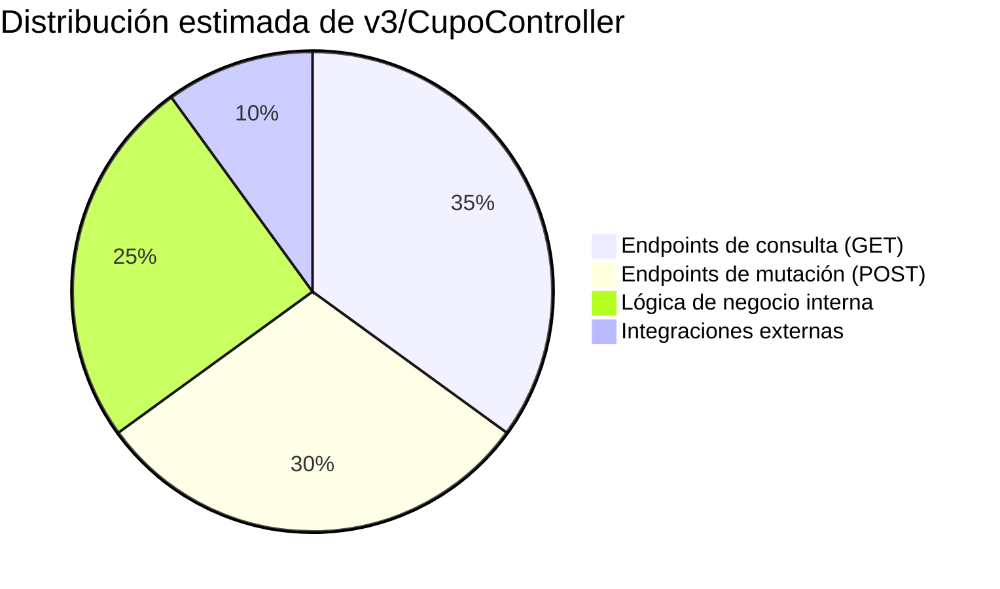
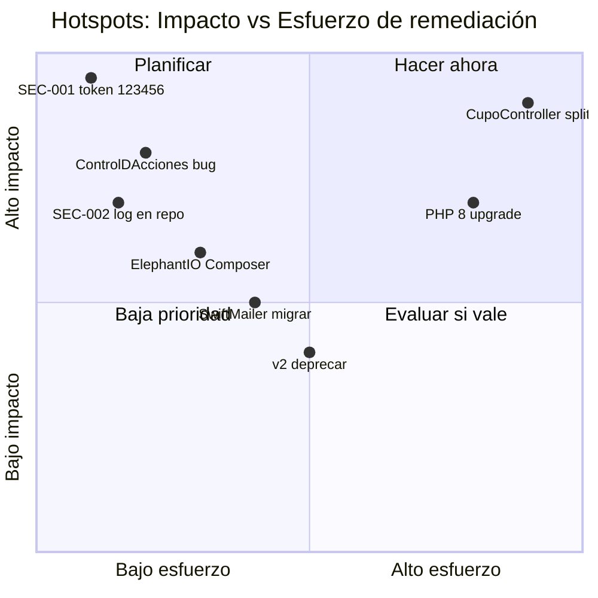

# Hotspots de Código

> **Última revisión:** 2026-04-21
> **Ver también:** [[deuda-tecnica]], [[recomendaciones-modernizacion]], [[modulo-v3]]

---

## Descripción

Los **hotspots** son archivos con alta complejidad, alto riesgo de bugs o alta frecuencia de cambios que requieren atención especial en cualquier tarea de mantenimiento.

---

## Top Hotspots por tamaño / complejidad

| Archivo | Líneas (aprox.) | Severidad | Problema |
|---------|----------------|-----------|---------|
| `backend/modules/v3/controllers/CupoController.php` | **5,754+** | 🔴 Crítico | God class — toda la lógica de cupos v3 en un archivo |
| `backend/controllers/CupoController.php` | ~3,000+ | 🔴 Crítico | Lógica v1 sin separación de capas |
| `backend/controllers/ViajeController.php` | ~1,500+ | 🟠 Alto | Viajes con estados mixtos |
| `backend/modules/magyp/controllers/CadenaController.php` | ~800+ | 🟡 Medio | Integración AFIP/MAGYP centralizada |
| `common/components/Metodos.php` | ~500+ | 🟠 Alto | Bolsa de utilidades heterogéneas |
| `backend/behaviours/ControlDAcciones.php` | ~80 | 🟠 Alto | Dos métodos `beforeAction` sobreescritos |

---

## Análisis: v3/CupoController.php (5,754 líneas)



**Problemas identificados:**
1. Sin capa de servicio/use-case — toda la lógica está en el controller
2. Sin repositorio — consultas SQL embebidas directamente
3. Responsabilidad múltiple: CRUD + AFIP + notificaciones + reportes
4. Difícil de testear unitariamente
5. Alto riesgo de regresiones en cualquier cambio

**Endpoints contados:** 50+ actions en un solo controller

---

## Análisis: common/components/Metodos.php

Este archivo es una "clase bolsa" con métodos heterogéneos:
- `sendSms()` — Envío SMS Infobip
- Helpers de fecha/hora
- Utilidades de string
- Funciones de cálculo de distancia

**Problema:** Sin cohesión. Es el primer lugar donde va cualquier función que no tiene dónde más ir.

---

## Análisis: ControlDAcciones.php (doble beforeAction)

```php
// PROBLEMA: dos métodos con el mismo nombre en una clase
public function beforeAction($action) { /* AccessControl */ }
public function beforeAction($event)  { /* VerbFilter */ }
```

En PHP, el segundo método sobreescribe al primero. El control de acceso RBAC (`AccessControl`) nunca se ejecuta desde esta clase — solo el control de verbos HTTP. Esto puede ser un bug de seguridad latente.

---

## Hotspots por antigüedad / deuda acumulada

| Área | Indicadores de deuda |
|------|---------------------|
| Módulo v2 | Código duplicado de v3, sin nuevas features, pendiente deprecar |
| `ElephantIO/` local | Sin versión, sin parches |
| `backend/views/` | Vistas PHP mezcladas con lógica |
| Migraciones (623+) | Sin squash → tiempo de bootstrap alto en entornos nuevos |
| Código comentado | Múltiples bloques `//echo ...; //exit;` en behaviours |

---

## Recomendaciones de prioridad


