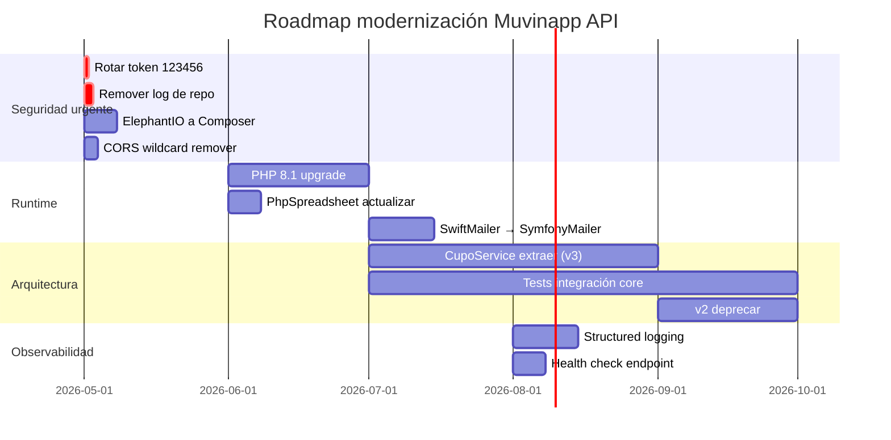

# Recomendaciones de Modernización

> **Última revisión:** 2026-04-21
> **Ver también:** [[deuda-tecnica]], [[hotspots]], [[stack-tecnologico]]

---

## Visión de modernización

El sistema Muvinapp tiene 8+ años de desarrollo activo sobre Yii2/PHP 7.4. Las recomendaciones apuntan a **estabilizar sin reescribir**, priorizando cambios que reduzcan riesgo operativo y mejoren la mantenibilidad.

---

## Roadmap de modernización



---

## REC-001 — Actualizar a PHP 8.1 / 8.2

**Justificación:** PHP 7.4 sin soporte desde noviembre 2022.

**Pasos:**
1. Verificar compatibilidad de todas las dependencias Composer con PHP 8.1
2. Correr `composer require --dev phpstan/phpstan` y analizar deprecations
3. Actualizar `Dockerfile`: `FROM php:8.1-fpm`
4. Ejecutar suite de tests antes y después
5. Deploy en staging primero

**Dependencias a verificar:** Yii2 2.0.48 es compatible con PHP 8.1. Verificar `linslin/yii2-curl`, `kartik-v/yii2-mpdf`.

---

## REC-002 — Migrar SwiftMailer → Symfony Mailer

**Dependencia actual:** `yiisoft/yii2-swiftmailer ~2.0` (archivado)
**Dependencia nueva:** `yiisoft/yii2-symfonymailer`

```bash
composer remove yiisoft/yii2-swiftmailer
composer require yiisoft/yii2-symfonymailer
```

**Cambios en config (`main.php`):**
```php
// Antes
'mailer' => ['class' => 'yii\swiftmailer\Mailer', ...]

// Después
'mailer' => ['class' => 'yii\symfonymailer\Mailer', ...]
```

---

## REC-003 — Mover ElephantIO a Composer

```bash
composer require elephantio/elephant.io
git rm -r backend/ElephantIO/
```

Actualizar todos los `use` imports de `backend\ElephantIO\` a `ElephantIO\`.

---

## REC-004 — Separar CupoController en Services

**Objetivo:** Extraer la lógica de negocio de `v3/CupoController.php` (5,754 líneas) a una capa de servicios.

**Estructura propuesta:**
```
common/
  services/
    CupoService.php          ← Lógica de negocio de cupos
    ViajeService.php         ← Lógica de viajes
    AfipIntegracionService.php ← Integración AFIP
    NotificacionService.php  ← Envío de notificaciones
```

**Estrategia:** Extraer un método a la vez, comenzando por los más testeados o más frecuentemente modificados. No reescribir todo de golpe.

---

## REC-005 — Implementar rate limiting en login

```php
// En LoginController
public function behaviors() {
    return array_merge(parent::behaviors(), [
        'rateLimiter' => [
            'class' => \yii\filters\RateLimiter::class,
        ],
    ]);
}
```

Requiere implementar `RateLimitInterface` en el modelo `User` o usar un componente de rate limiting basado en Redis.

---

## REC-006 — Agregar tests de integración

**Prioridad de cobertura:**

1. `POST /login` — autenticación
2. `POST /v3/cupos` — creación de cupo
3. `POST /v3/cupos/asignar` — asignación
4. `POST /carta-porte/emitir` — CPe (con mock de AFIP)
5. Flujo completo cupo → viaje → descarga

**Framework:** Codeception ya está configurado (`codeception.yml`). Solo falta escribir los tests.

---

## REC-007 — Structured Logging

**Estado actual:** Logs en archivos de texto, algunos committados.

**Recomendación:** Implementar structured logging con PSR-3:

```php
// Usar Monolog via Composer
composer require monolog/monolog

// Configurar en main.php
'log' => [
    'targets' => [
        ['class' => 'yii\log\FileTarget', 'levels' => ['error', 'warning']],
        // Agregar: FileTarget con JSON formatter
    ],
],
```

---

## REC-008 — Health check endpoint

Implementar `GET /health` que retorne:

```json
{
  "status": "ok",
  "db": "ok",
  "queue": "ok",
  "afip_ms": "ok",
  "version": "1.0.0"
}
```

Para uso con Docker healthcheck y monitoring.

---

## REC-009 — Refresh tokens

Implementar el patrón de refresh token para evitar reautenticación frecuente:

1. En login: retornar `access_token` (TTL corto: 1h) + `refresh_token` (TTL largo: 30d)
2. Nuevo endpoint `POST /auth/refresh` → intercambia refresh_token por nuevo access_token
3. La tabla `access_tokens` ya tiene estructura compatible

---

## REC-010 — Deprecar módulo v2 formalmente

1. Agregar header `Deprecation: true` en respuestas del módulo v2
2. Notificar a clientes con fecha de corte
3. Monitorear uso del módulo v2 en logs
4. En fecha de corte: retornar `410 Gone` en todos los endpoints v2
5. Eliminar código del repositorio

---

## No hacer (anti-patrones a evitar)

> [!warning] No reescribir en otro framework
> Migrar de Yii2 a Symfony/Laravel en un sistema de este tamaño sin tests es extremadamente arriesgado. Preferir evolución incremental.

> [!warning] No agregar microservicios prematuramente
> El sistema ya tiene integración con varios microservicios. Antes de extraer más, resolver la deuda técnica interna.
