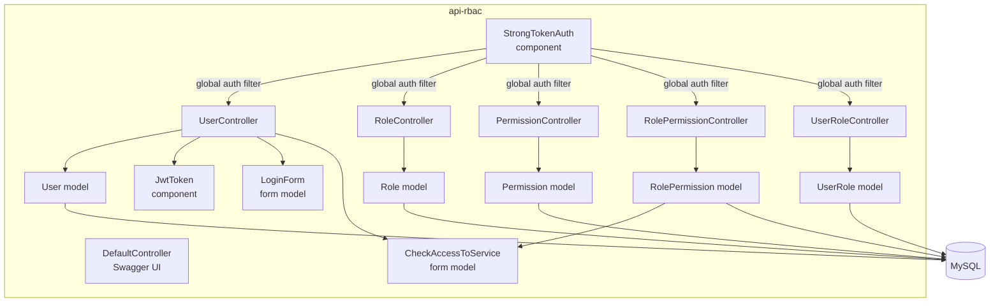
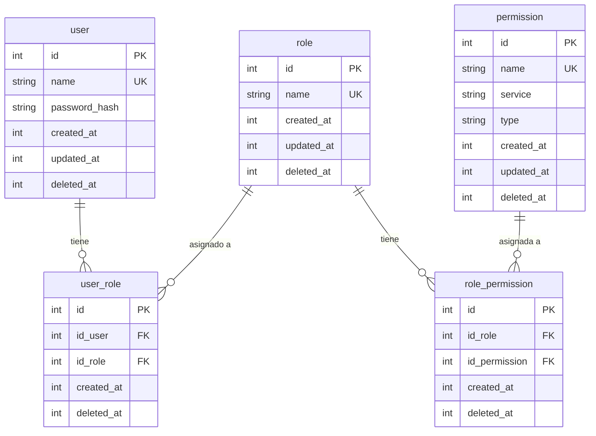

# Arquitectura de Alto Nivel — api-rbac

## Diagrama de componentes

## Routing

Las rutas se definen mediante `yii\rest\UrlRule` en `config/main.php`:

| Patrón | Controller | Verbos disponibles |
|--------|------------|--------------------|
| `/user` | UserController | GET, POST |
| `/user/{id}` | UserController | GET, PUT/PATCH, DELETE |
| `/user/login` | UserController | POST |
| `/user/decode-token` | UserController | POST |
| `/user/change-password` | UserController | PUT |
| `/user/check-access-to-service` | UserController | POST |
| `/user/by-roles` | UserController | GET |
| `/role` | RoleController | GET, POST |
| `/role/{id}` | RoleController | GET, PUT/PATCH, DELETE |
| `/role/by-users` | RoleController | GET |
| `/permission` | PermissionController | GET, POST |
| `/permission/{id}` | PermissionController | GET, PUT/PATCH, DELETE |
| `/permission/by-roles` | PermissionController | GET |
| `/permission/by-users` | PermissionController | GET |
| `/role-permission` | RolePermissionController | POST, DELETE |
| `/user-role` | UserRoleController | POST, DELETE |
| `/` | DefaultController | GET (Swagger UI) |

## Modelo de datos — relaciones

