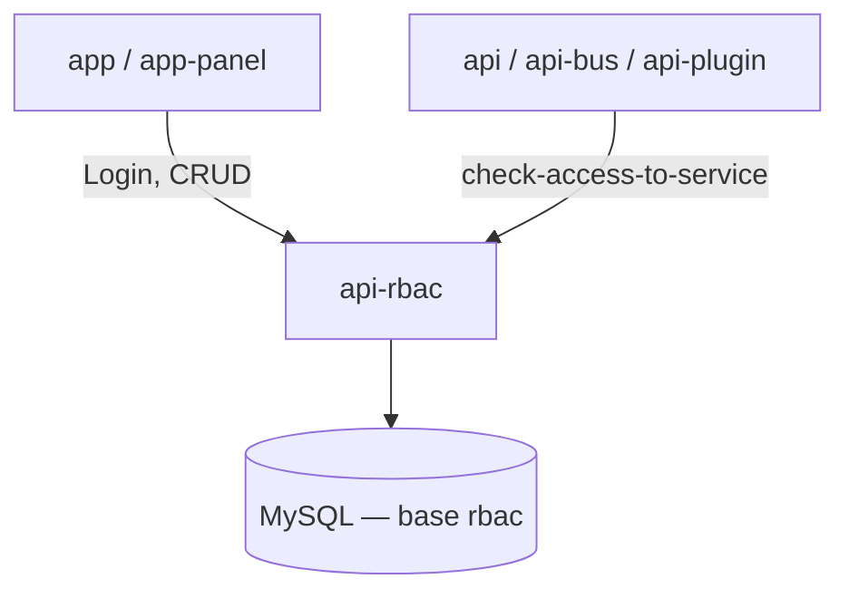
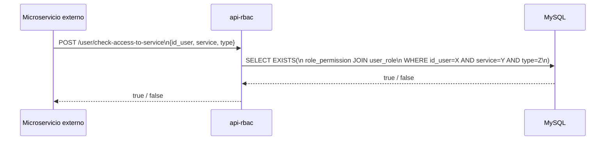

# Visión General — api-rbac

## Propósito

`api-rbac` es el microservicio centralizado de **Role-Based Access Control (RBAC)** de la plataforma Muvin Latam. Provee:

1. **Gestión de entidades:** CRUD completo de Usuarios, Roles y Permisos.
2. **Asociaciones:** Vinculación de Roles↔Permisos y Usuarios↔Roles.
3. **Verificación de acceso:** Endpoint `check-access-to-service` que otros microservicios consultan para autorizar operaciones.
4. **Autenticación:** Login con usuario/contraseña → JWT HS512.

## Posición en la plataforma

## Flujo principal de autorización

## Responsabilidades

| Responsabilidad | Descripción |
|----------------|-------------|
| Gestión de usuarios | CRUD + cambio de contraseña, login, decode-token |
| Gestión de roles | CRUD + listar roles por usuario |
| Gestión de permisos | CRUD + listar permisos por rol o por usuario |
| Asociación rol↔permiso | Crear/eliminar vínculos en lote |
| Asociación usuario↔rol | Crear/eliminar vínculos en lote |
| Verificación de acceso | Dado `id_user + service + type` → retorna bool |

## Limitaciones conocidas

- El `StrongTokenAuth` usa un **seed estático** (`'123456'` en config de ejemplo) como "API key" entre servicios — no es un sistema de auth seguro.
- No hay refresh token — el JWT expira en 3600s y no se puede renovar sin nuevo login.
- Soft deletes: los registros nunca se eliminan físicamente (`deleted_at` timestamp).
