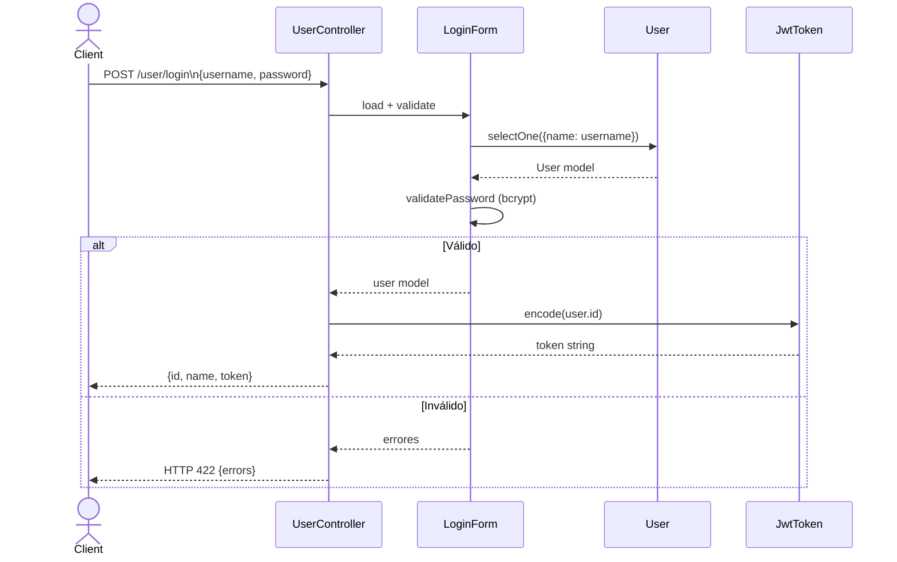

# Funcionalidad: Login de Usuario

## Descripción

Autentica un usuario por `username` + `password` y retorna un JWT HS512.

## Flujo



## Request

```json
POST /user/login
Authorization: {seed}
Content-Type: application/json

{
  "username": "admin",
  "password": "secreto123"
}
```

## Response exitoso (200)

```json
{
  "id": 1,
  "name": "admin",
  "token": "eyJhbGciOiJIUzUxMiIsInR5cCI6IkpXVCJ9..."
}
```

## Response error (422)

```json
[
  { "field": "password", "message": "Usuario o contraseña incorrecta" }
]
```

## Notas

- El token expira en **3600 segundos** (configurable en `params.php`).
- No hay endpoint de refresh — el usuario debe hacer login de nuevo.
- El endpoint requiere el header `Authorization: {seed}` de inter-servicios (no el JWT de usuario).

## Referencias

- [[modulo-user-controller]]
- [[modulo-form-models#login-form]]
- [[modulo-jwt-token]]
