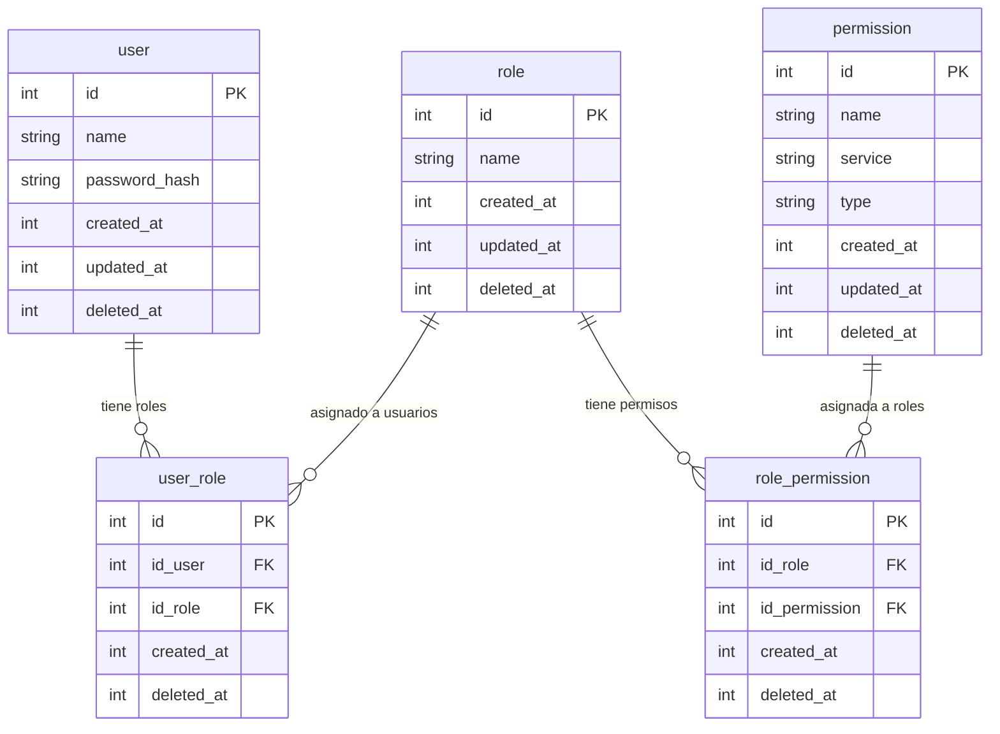

# Índice de Entidades / Modelo de Datos

| # | Entidad | Tabla | Archivo |
|---|---------|-------|---------|
| 1 | [User](./entidad-user.md) | `user` | models/User.php |
| 2 | [Role](./entidad-role.md) | `role` | models/Role.php |
| 3 | [Permission](./entidad-permission.md) | `permission` | models/Permission.php |
| 4 | [RolePermission](./entidad-role-permission.md) | `role_permission` | models/RolePermission.php |
| 5 | [UserRole](./entidad-user-role.md) | `user_role` | models/UserRole.php |

## Diagrama ER completo

## Patrón de soft delete

Todas las tablas usan `deleted_at` (INT NULL). El valor `NULL` indica activo, un timestamp Unix indica eliminado. Los índices `UNIQUE` incluyen `deleted_at` para permitir reutilizar valores después de eliminar.
