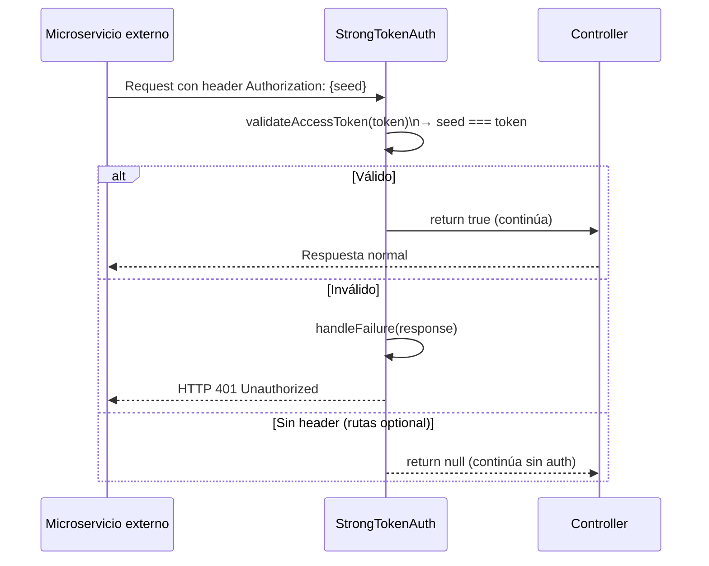

# Flujo: Autenticación Inter-Servicios (Seed)

## Descripción

Todo request a `api-rbac` (excepto la Swagger UI) requiere un header `Authorization` con el valor del `seed` configurado. Es el mecanismo que identifica a los microservicios autorizados.

## Diagrama



## Rutas exentas de auth

```php
'optional' => [
    'default/index',   // GET / → Swagger UI
    'default/api',     // GET /api → spec JSON
    'debug/*'          // Debug toolbar (solo dev)
]
```

## Configuración

```php
// config/main.php
'as accessControl' => [
    'class' => StrongTokenAuth::class,
    'seed' => '123456', // ← debe ser un secret seguro en producción
]
```

## Notas de seguridad

- El seed es compartido con todos los microservicios que necesiten llamar a `api-rbac`.
- Si se compromete, todos los endpoints quedan expuestos.
- No hay distinción de permisos entre microservicios — todos ven todo.
