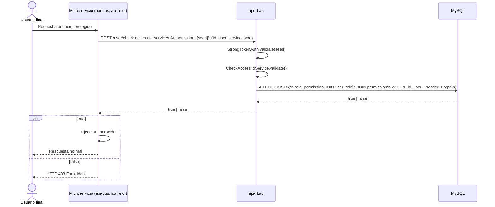
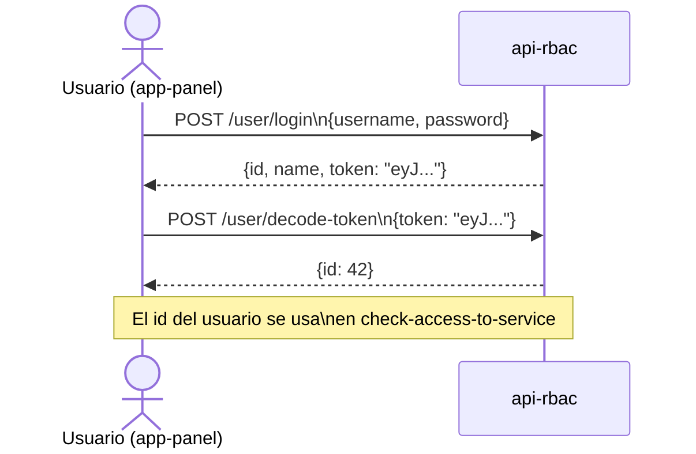

# Flujo: Check-Access desde Microservicio Externo

## Descripción

El flujo más importante del sistema. Un microservicio externo verifica si un usuario tiene permiso para ejecutar una operación.

## Diagrama completo



## Convención de `service` y `type`

Cada microservicio define sus propios valores de `service` al registrar permisos. Ejemplo:

| service | type | Descripción |
|---------|------|-------------|
| `pedidos/crear` | POST | Crear un pedido |
| `chofer-app/postularme` | POST | Postularse a una carga |
| `usuarios/admin` | DELETE | Eliminar usuarios |

## Flujo: Login + uso de JWT



## Flujo: Setup RBAC completo

```mermaid
flowchart TD
    A[Crear Permission\nPOST /permission\n{name, service, type}] --> B
    B[Crear Role\nPOST /role\n{name}] --> C
    C[Vincular Role+Permission\nPOST /role-permission\n{id_role, id_permission}] --> D
    D[Crear User\nPOST /user\n{name, password}] --> E
    E[Vincular User+Role\nPOST /user-role\n{id_user, id_role}] --> F
    F[✅ check-access-to-service retorna true]
```
