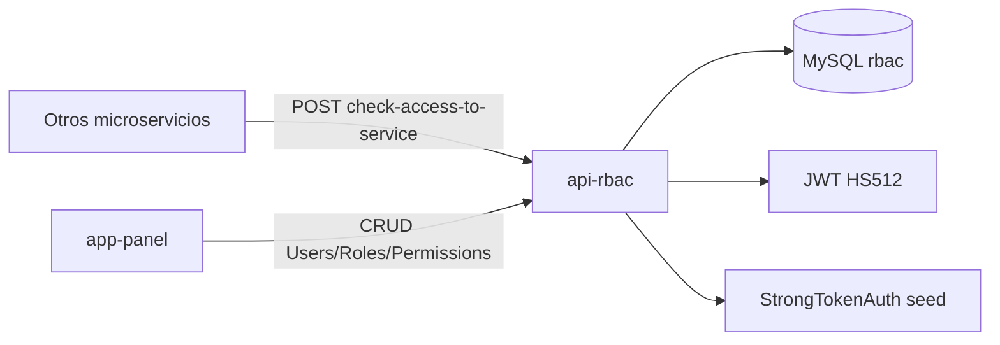

# api-rbac — Documentación

> **Versión:** 1.0 | **Stack:** PHP >=7.2 · Yii2 ~2.0.14 · MySQL · Docker
> **Propósito:** Microservicio de control de acceso basado en roles (RBAC) para la plataforma Muvin Latam.

## Descripción General

`api-rbac` es una API REST que centraliza la gestión de **usuarios, roles y permisos** de toda la plataforma. Los demás microservicios consultan este servicio para verificar si un usuario tiene acceso a una operación específica mediante el endpoint `POST /user/check-access-to-service`.

## Arquitectura rápida

## Índice de secciones

| Sección | Descripción |
|---------|-------------|
| [00 — Visión General](./00-overview/vision-general.md) | Propósito, arquitectura, stack |
| [01 — Módulos](./01-modulos/_indice-modulos.md) | Controllers, Models, Components |
| [02 — Funcionalidades](./02-funcionalidades/_indice-funcionalidades.md) | CRUD + check-access + JWT |
| [03 — Servicios Backend](./03-servicios-backend/_indice-servicios.md) | Todos los endpoints REST |
| [04 — Modelo de Datos](./04-modelo-de-datos/_indice-entidades.md) | Tablas y relaciones |
| [05 — Inventarios](./05-inventarios/tree-estructura-archivos.md) | Árbol, seguridad, dependencias |
| [06 — Flujos Transversales](./06-flujos-transversales/_indice-flujos.md) | Auth, check-access, CRUD |
| [07 — Operación y Despliegue](./07-operacion-y-despliegue/despliegue.md) | Docker, migraciones, env |
| [08 — Riesgos y Deuda Técnica](./08-riesgos-y-deuda-tecnica/riesgos-deuda-tecnica.md) | Bugs, hotspots, mejoras |
