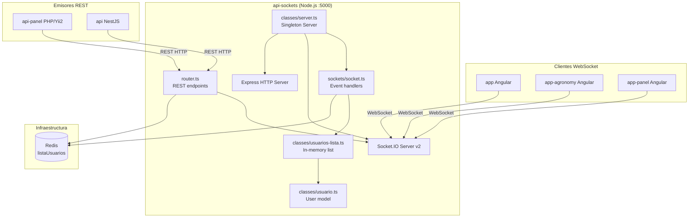

# Arquitectura de Alto Nivel — api-sockets

> [[vision-general]] | [[stack-tecnologico]]

## Diagrama de componentes



## Flujo de datos simplificado

```
Cliente Angular                api-sockets                    Redis
     │                              │                           │
     │── connect ──────────────────►│                           │
     │                              │── GET listaUsuarios ─────►│
     │── configurar-usuario ────────►│                           │
     │                              │── SET listaUsuarios ─────►│
     │                              │── emit usuario-conectado ─►│(todos)
     │                              │                           │
     │                              │                           │
[api-panel REST POST /notificacion] │                           │
     │                              │── GET listaUsuarios ─────►│
     │                              │◄─ lista ─────────────────│
     │◄─ emit mensaje-privado ──────│                           │
```

## Separación de responsabilidades

| Capa | Archivo | Responsabilidad |
|------|---------|-----------------|
| Bootstrap | `index.ts` | Arranque, middlewares, rutas |
| Singleton | `classes/server.ts` | Instancia única Express+Socket.IO+Redis |
| Eventos WS | `sockets/socket.ts` | Handlers de eventos Socket.IO |
| REST | `routes/router.ts` | Endpoints HTTP para emisión desde backends |
| Dominio | `classes/usuario.ts` / `usuarios-lista.ts` | Modelo y colección de usuarios |
| Config | `global/environment.ts` | Variables de entorno |
