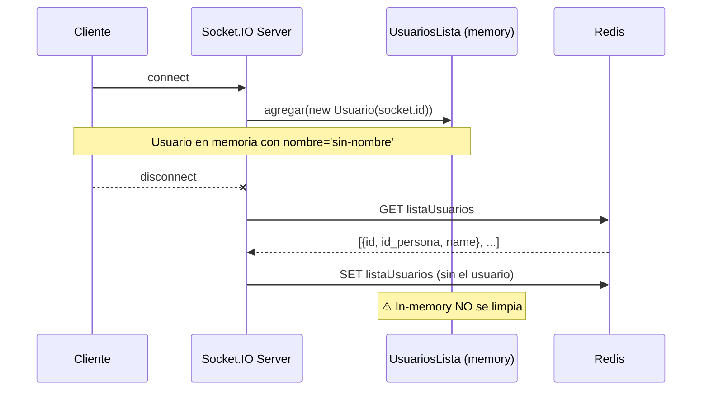

# F-01 / F-10: Conexión y Desconexión de Cliente

> [[_indice-funcionalidades]] | Módulo: [[modulo-socket]]

## F-01 — Conexión

**Trigger:** Socket.IO evento `connection` (automático al conectar el cliente)

### Comportamiento
1. Socket.IO asigna un `socket.id` único al cliente
2. Se crea un `new Usuario(socket.id)` con `nombre='sin-nombre'`
3. Se agrega a `usuariosConectados` (in-memory)
4. Log en consola

### Estado después de F-01
- El usuario **existe** en memoria pero **aún no está en Redis**
- `nombre = 'sin-nombre'` → no aparece en `getLista()` (filtrado)
- El cliente debe emitir `configurar-usuario` para completar el registro

---

## F-10 — Desconexión

**Trigger:** Socket.IO evento `disconnect` (automático al cerrar la conexión)

### Comportamiento
1. Lee `listaUsuarios` desde Redis
2. Busca el elemento con `id === cliente.id`
3. Hace `splice` para eliminarlo
4. Escribe el array actualizado en Redis

### Limitaciones
- La eliminación de `usuariosConectados` (in-memory) está **comentada** en el código
- La lista in-memory crece indefinidamente con usuarios desconectados
- Si Redis tiene `null` (no inicializado), el `JSON.parse(null)` lanza excepción

### Diagrama

