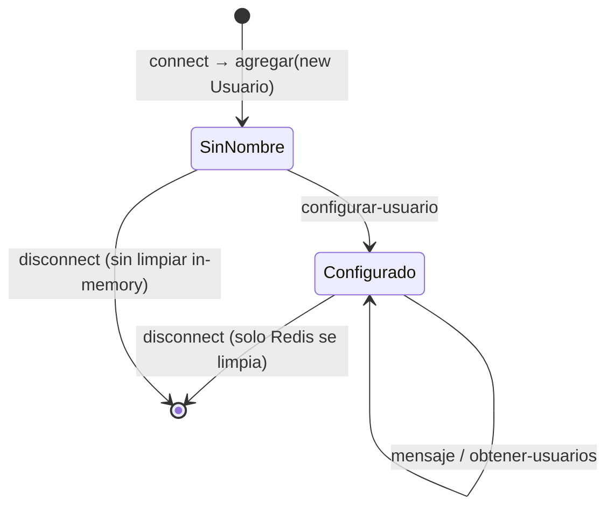

# Modelo de Datos — api-sockets

> [[../README]]

api-sockets **no tiene base de datos relacional**. Su estado se distribuye entre dos almacenamientos:

## 1. Redis — `listaUsuarios`

**Clave:** `listaUsuarios`  
**Tipo:** String (JSON serializado)  
**Formato:**
```json
[
    { "id": "<socket.id>", "id_persona": 5, "name": "Carlos" },
    { "id": "<socket.id>", "id_persona": 12, "name": "Ana" }
]
```

| Campo | Tipo | Descripción |
|-------|------|-------------|
| `id` | string | `socket.id` de la conexión actual |
| `id_persona` | number | ID de persona en la BD de Muvin |
| `name` | string | Nombre del usuario |

**Operaciones:**
- `SET listaUsuarios <json>` — al conectar/desconectar
- `GET listaUsuarios` — en notificación, desconexión, REST `/usuarios`
- Inicialización con `[]` via `GET /borrar-usuarios`

> ⚠️ `id` (socket.id) cambia con cada reconexión. Si un usuario cierra y abre la app, queda entrada duplicada hasta que se desconecte correctamente.

---

## 2. UsuariosLista — In-memory

Array en memoria del proceso Node. Se pierde al reiniciar.

### Entidad `Usuario`

```typescript
class Usuario {
    id: string;         // socket.id
    nombre: string;     // default: 'sin-nombre'
    sala: string;       // default: 'sin-sala' (no usado)
    id_chofer?: number; // si aplica
    id_centro?: number; // si aplica
    consultas?: boolean;// default: false
}
```

### Diagrama de estados del Usuario



---

## Comparativa de almacenamientos

| Característica | Redis | In-memory |
|----------------|-------|-----------|
| Persiste reinicios | ✅ | ❌ |
| Campos almacenados | `{id, id_persona, name}` | Todos los campos |
| Sincronización en disconnect | ✅ | ❌ (comentado) |
| Usado para notificación | ✅ | ❌ |
| Usado para chofer/consulta | ❌ | ✅ |
| Riesgo de inconsistencia | ✅ Entradas huérfanas | ✅ Crece indefinidamente |
