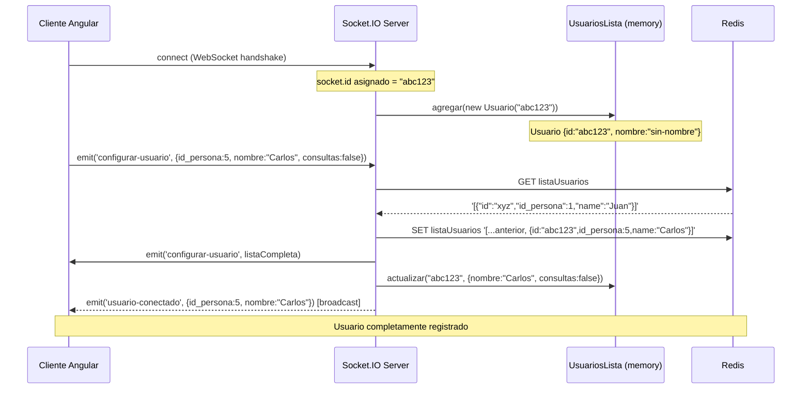

# FL-01: Conexión y Registro de Usuario

> [[_indice-flujos]] | Módulos: [[modulo-server]], [[modulo-socket]], [[modulo-usuarios]]

## Diagrama de secuencia

## Estados del usuario a lo largo del flujo

| Paso | In-memory | Redis |
|------|-----------|-------|
| Antes de connect | No existe | No existe |
| Tras connect | `{nombre:'sin-nombre'}` | No existe |
| Tras configurar-usuario | `{nombre:'Carlos', consultas:false, ...}` | `{id, id_persona:5, name:'Carlos'}` |

## Casos de error

| Situación | Comportamiento |
|-----------|---------------|
| Redis no inicializado (`GET` retorna `null`) | `JSON.parse(null)` → puede causar excepción |
| Cliente desconecta antes de `configurar-usuario` | Entrada in-memory nunca se limpia |
| `configurar-usuario` enviado múltiples veces | Entradas duplicadas en Redis |
