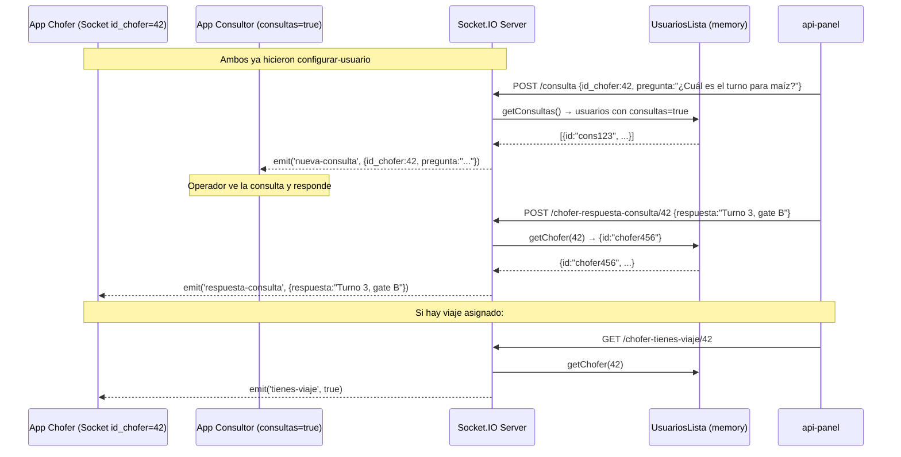

# FL-03: Consulta y Respuesta de Chofer

> [[_indice-flujos]] | Módulos: [[modulo-router]], [[modulo-usuarios]]

## Contexto

Un chofer (en app-agronomy) solicita información. Un operador logístico ("consultor") la recibe y responde. El ciclo completo pasa por api-sockets.

## Diagrama de secuencia

## Requisito previo crítico

`getChofer(id_chofer)` y `getConsultas()` buscan en **in-memory** (`UsuariosLista`).  
Si el proceso Node reinició, la lista está vacía y ningún chofer ni consultor será encontrado.

**Solución operativa:** Tras reiniciar el servidor, todos los clientes deben reconectarse y re-emitir `configurar-usuario`.
