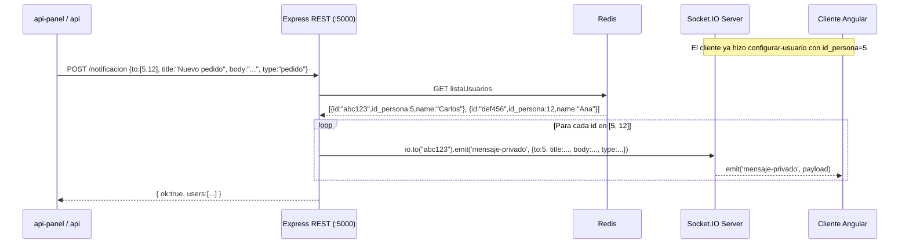

# FL-02: Notificación a Usuario por id_persona

> [[_indice-flujos]] | Módulos: [[modulo-router]]

## Diagrama de secuencia



## Payload del evento `mensaje-privado` recibido por el cliente

```json
{
    "to": 5,
    "title": "Nuevo pedido",
    "body": "Tiene un pedido de 50 tn de soja",
    "type": "pedido"
}
```

## Escenarios de fallo

| Escenario | Resultado |
|-----------|-----------|
| Usuario no en Redis (no llamó `configurar-usuario`) | No recibe nada, sin error |
| Redis retorna `null` | `JSON.parse(null)` → excepción → HTTP 500 |
| Usuario desconectado pero aún en Redis | `io.to(id)` emite a nadie, sin error |
| Múltiples sesiones del mismo `id_persona` | Recibe el evento en todas las sesiones activas |
