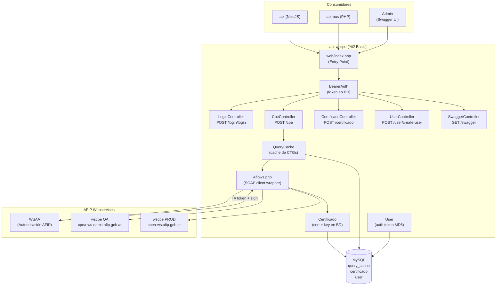
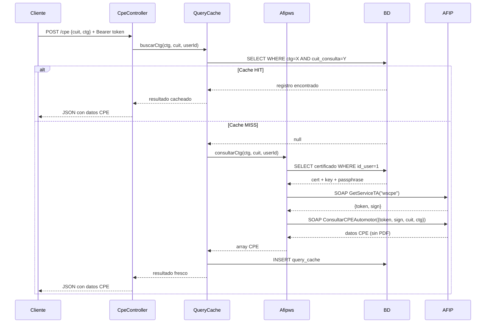

# Arquitectura de Alto Nivel — api-wscpe

> [[README]] · [[vision-general]]

## Diagrama de componentes



## Flujo de una consulta CPE



## Wrapper de respuesta global

Todas las respuestas de la API son envueltas automáticamente en `config/web.php` (`beforeSend`):

```json
{
  "success": true,
  "status": 200,
  "data": { ... }
}
```

Excepto la respuesta del `SwaggerController` que devuelve HTML.

## Entornos AFIP

| Parámetro `ENTORNO_WS` | WSAA | WSCPE |
|------------------------|------|-------|
| `TEST` (default) | homologación | `cpea-ws-qaext.afip.gob.ar` |
| `PROD` | producción | `cpea-ws.afip.gob.ar` |
