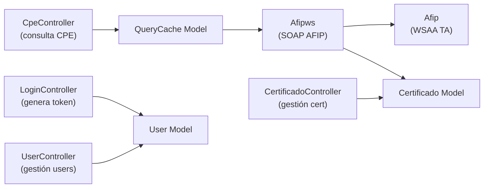

# Índice de Módulos — api-wscpe

> [[README]]

## Controllers (módulos de la API)

| Controller | Archivo | Ruta base | Auth requerida | Enlace |
|-----------|---------|-----------|----------------|--------|
| [LoginController](./modulo-login.md) | `LoginController.php` | `/login` | ❌ (público) | `modulo-login.md` |
| [CpeController](./modulo-cpe.md) | `CpeController.php` | `/cpe` | ✅ Bearer | `modulo-cpe.md` |
| [CertificadoController](./modulo-certificado.md) | `CertificadoController.php` | `/certificado` | ✅ Bearer + admin | `modulo-certificado.md` |
| [UserController](./modulo-user.md) | `UserController.php` | `/user` | ✅ Bearer + admin | `modulo-user.md` |
| [SwaggerController](./modulo-swagger.md) | `SwaggerController.php` | `/swagger` | ❌ (público) | `modulo-swagger.md` |

## Componentes internos

| Componente | Archivo | Rol |
|-----------|---------|-----|
| [Afipws](./modulo-afipws.md) | `components/Afipws.php` | Wrapper SOAP para WSCPE de AFIP | 
| [Afip](./modulo-afipws.md) | `components/Afip.php` | Cliente WSAA (obtención de TA) |

## Relación entre módulos

