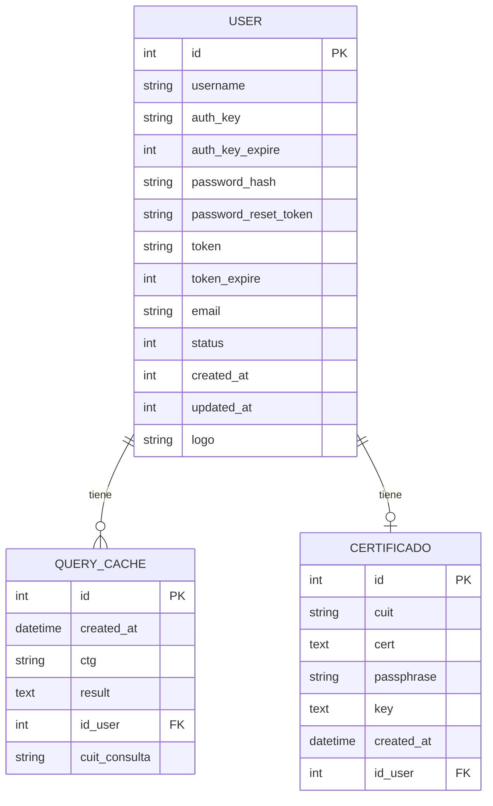

# Modelo de Datos — api-wscpe

> [[README]]

## Diagrama ER

## Tablas

### `user`
Usuarios de la API. Creada en migración `m230725_232038_create_users_table.php`.

| Campo | Tipo | Descripción |
|-------|------|-------------|
| `id` | INT PK | Autoincremental |
| `username` | VARCHAR(32) | Nombre de usuario |
| `auth_key` | VARCHAR(32) | Clave de autorización (Yii2) |
| `password_hash` | VARCHAR | Hash bcrypt del password |
| `token` | VARCHAR(300) | Token de acceso activo |
| `token_expire` | INT | Unix timestamp de expiración |
| `status` | INT | 1 = activo |
| `created_at` / `updated_at` | INT | Unix timestamps |

### `query_cache`
Caché de consultas a AFIP. Migración `m230725_233021_create_query_cache_table.php` + alteraciones posteriores.

| Campo | Tipo | Descripción |
|-------|------|-------------|
| `id` | INT PK | Autoincremental |
| `created_at` | DATETIME | Fecha de la consulta |
| `ctg` | VARCHAR(70) | Número de CTG consultado |
| `cuit_consulta` | VARCHAR(11) | CUIT que realizó la consulta |
| `result` | TEXT | JSON serializado de la respuesta AFIP |
| `id_user` | INT FK | Siempre `1` en la implementación actual |

### `certificado`
Almacena el certificado X.509 del operador AFIP. Migración `m230901_061922_certificate_table_create.php`.

| Campo | Tipo | Descripción |
|-------|------|-------------|
| `id` | INT PK | Autoincremental |
| `cuit` | VARCHAR(255) | CUIT del certificado |
| `cert` | TEXT | Cadena PEM del certificado |
| `passphrase` | VARCHAR(255) | Passphrase de la clave privada |
| `key` | TEXT | Cadena PEM de la clave privada |
| `created_at` | DATETIME | Fecha de carga |
| `id_user` | INT FK | Usuario propietario (siempre `1`) |

> 🔴 `cert`, `key` y `passphrase` se almacenan en texto plano. Ver [security-inventory](./05-inventarios/security-inventory.md).

## Migraciones en orden cronológico

| Migración | Fecha | Descripción |
|-----------|-------|-------------|
| `m230725_232038` | 2023-07-25 | Crear tabla `user` |
| `m230725_233021` | 2023-07-25 | Crear tabla `query_cache` |
| `m230901_061922` | 2023-09-01 | Crear tabla `certificado` |
| `m230925_092932` | 2023-09-25 | Agregar `cuit_consulta` a `query_cache` |
| `m230926_141806` | 2023-09-26 | Cambiar tipo de `ctg` en `query_cache` |
