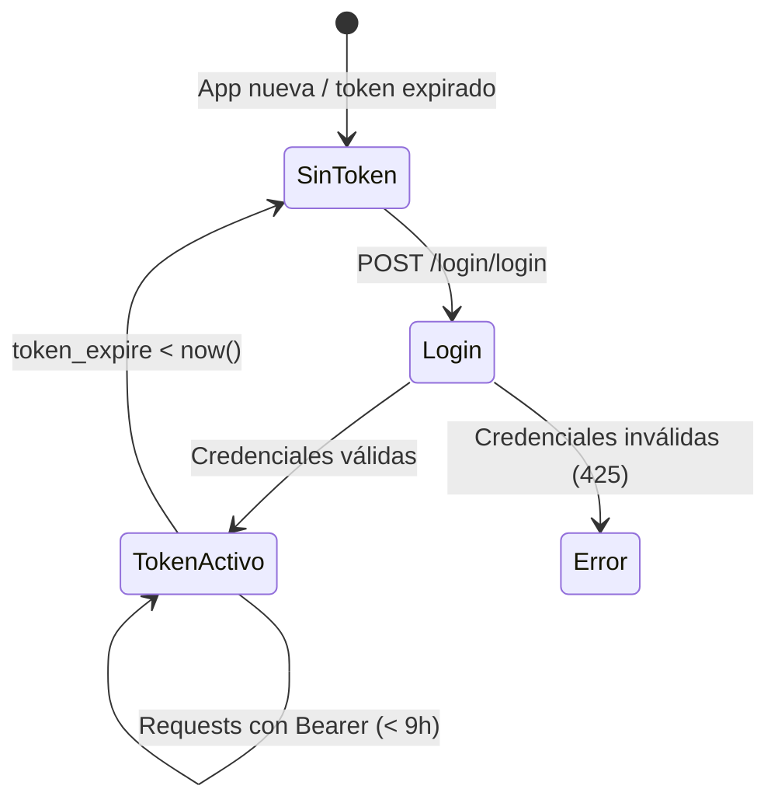

# Flujo: Autenticación y Token

> [[_indice-flujos]] | Módulo: [[modulo-login]]

## Ciclo de vida del token



## Uso del token

```bash
# 1. Obtener token
curl -X POST https://<host>/login/login \
  -H "Content-Type: application/json" \
  -d '{"username":"admin","password":"password"}'

# Respuesta
# { "success":true, "status":200, "data": {"access_token":"abc123...", "expires_at":"2024-01-15 18:00:00"} }

# 2. Usar token en /cpe
curl -X POST https://<host>/cpe \
  -H "Authorization: Bearer abc123..." \
  -H "Content-Type: application/json" \
  -d '{"cuit":"20123456789","ctg":123456}'
```

## Reutilización de token

Si el token existente no ha expirado, el endpoint de login lo devuelve sin generar uno nuevo:
```php
if ($user->token == null || $user->token_expire == null || $user->token_expire < time()) {
    // Generar nuevo token
} else {
    // Reutilizar token existente
}
```
