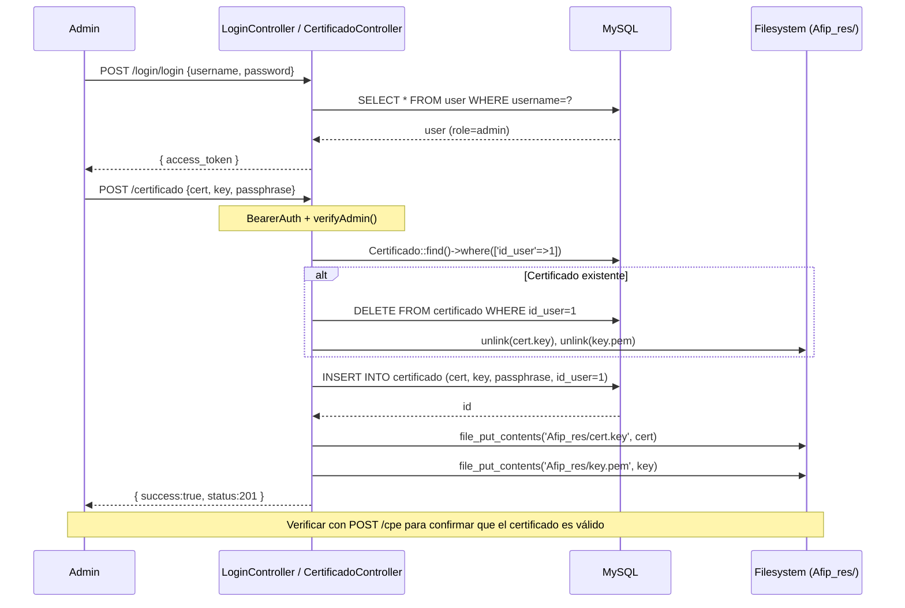

# Flujo: Carga de Certificado AFIP

> [[_indice-flujos]] | Módulo: [[modulo-certificado]]

## Secuencia

## Efectos en el sistema

| Efecto | Detalle |
|--------|---------|
| BD actualizada | Tabla `certificado` reemplazada para `id_user = 1` |
| Archivos reemplazados | `Afip_res/cert.key` y `Afip_res/key.pem` sobrescritos |
| Caché de TA invalidado | `Afip_TA/TA.xml` sigue vigente hasta TTL WSAA, pero el próximo request lo renovará automáticamente si cambiaron los credenciales |

## Riesgos operativos

- **Condición de carrera:** Si dos requests `/cpe` llegan mientras se sube el certificado, pueden leer archivos incompletos.
- **Sin rollback:** Si el `file_put_contents` falla, la BD ya contiene el nuevo certificado pero el archivo en disco es el anterior.
- **Passphrase en texto plano:** Almacenada directamente en la tabla `certificado`.
