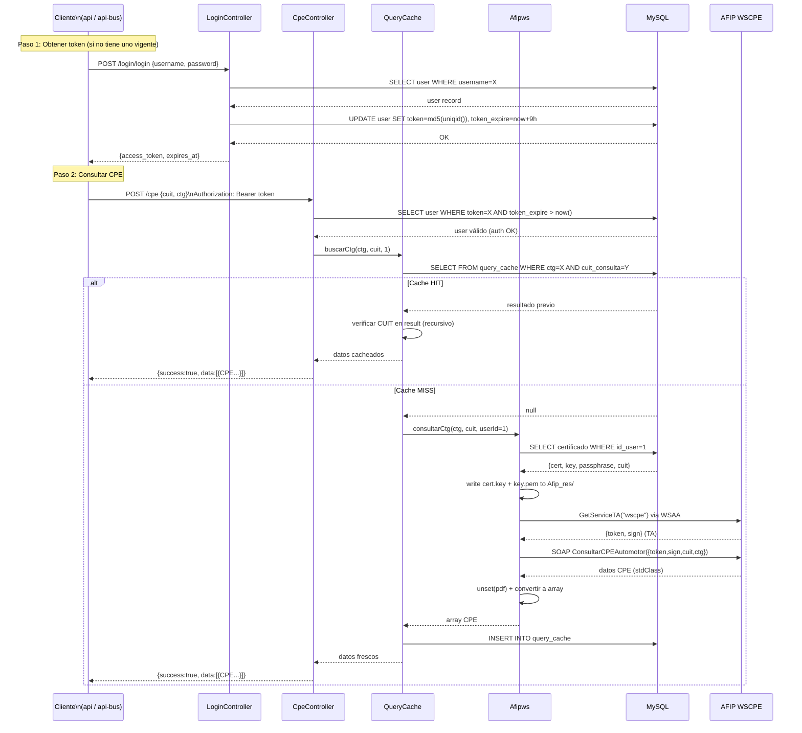

# Flujo: Consulta CPE Completa

> [[_indice-flujos]] | Módulos: [[modulo-login]] → [[modulo-cpe]] → [[modulo-afipws]]

## Diagrama end-to-end

## Puntos de fallo

| Punto | Causa | Comportamiento |
|-------|-------|----------------|
| Token expirado | TTL 9h vencido | HTTP 401 |
| Certificado no cargado | BD `certificado` vacía | Exception en `Afipws::conectar()` |
| AFIP no disponible | WS caído | `data: ["Error en el WEBSERVICE - ..."]` con HTTP 200 |
| CUIT no delegado | AFIP rechaza consulta | `data: ["El cuit X no se puede consultar (no delegado)"]` |
| CTG inexistente | AFIP no encuentra el CTG | Respuesta de error de AFIP en `data` |
